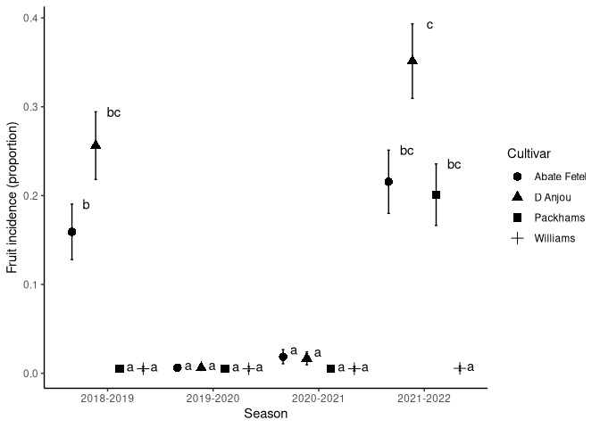
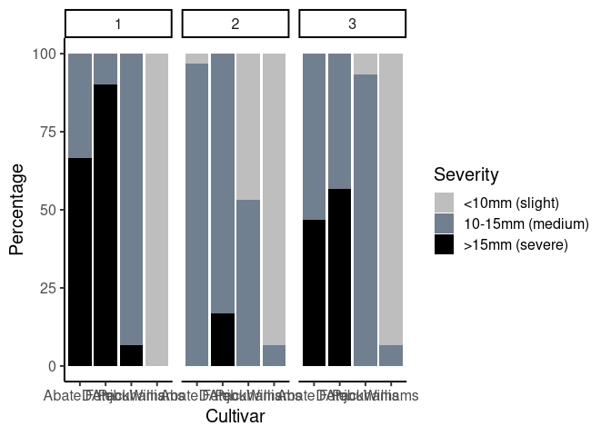

Susceptibility of pear cultivars to Stemphylium vesicarium
================

## Natural infection

Load tidyverse libraries.

``` r
library(tidyverse)
```

    ## ── Attaching packages ─────────────────────────────────────── tidyverse 1.3.1 ──

    ## ✔ ggplot2 3.3.6     ✔ purrr   0.3.4
    ## ✔ tibble  3.1.7     ✔ dplyr   1.0.9
    ## ✔ tidyr   1.2.0     ✔ stringr 1.4.0
    ## ✔ readr   2.0.0     ✔ forcats 0.5.1

    ## ── Conflicts ────────────────────────────────────────── tidyverse_conflicts() ──
    ## ✖ dplyr::filter() masks stats::filter()
    ## ✖ dplyr::lag()    masks stats::lag()

Import data from csv.

``` r
campo2 <-read.table("campo2.csv", sep=";", header=TRUE, dec=",")
```

Print head from dataframe

``` r
head(campo2) 
```

    ##   Cultivar    Season Repetition Fruits.incidence Leaves.incidence Observed
    ## 1 Williams 2018-2019          1                0                0      100
    ## 2 Williams 2018-2019          2                0                0      100
    ## 3 Williams 2018-2019          3                0                0      100
    ## 4 Williams 2018-2019          4                0                0      100
    ## 5 Williams 2018-2019          5                0                0      100
    ## 6 Packhams 2018-2019          1                0                0      100
    ##   prop.leaves prop.fruits
    ## 1           0           0
    ## 2           0           0
    ## 3           0           0
    ## 4           0           0
    ## 5           0           0
    ## 6           0           0

Now glimpse from variables.

``` r
glimpse(campo2)
```

    ## Rows: 80
    ## Columns: 8
    ## $ Cultivar         <chr> "Williams", "Williams", "Williams", "Williams", "Will…
    ## $ Season           <chr> "2018-2019", "2018-2019", "2018-2019", "2018-2019", "…
    ## $ Repetition       <int> 1, 2, 3, 4, 5, 1, 2, 3, 4, 5, 1, 2, 3, 4, 5, 1, 2, 3,…
    ## $ Fruits.incidence <int> 0, 0, 0, 0, 0, 0, 0, 0, 0, 0, 24, 18, 21, 30, 32, 11,…
    ## $ Leaves.incidence <int> 0, 0, 0, 0, 0, 0, 0, 2, 1, 0, 25, 35, 31, 32, 29, 33,…
    ## $ Observed         <int> 100, 100, 100, 100, 100, 100, 100, 100, 100, 100, 100…
    ## $ prop.leaves      <dbl> 0.00, 0.00, 0.00, 0.00, 0.00, 0.00, 0.00, 0.02, 0.01,…
    ## $ prop.fruits      <dbl> 0.00, 0.00, 0.00, 0.00, 0.00, 0.00, 0.00, 0.00, 0.00,…

Finally summary

``` r
summary(campo2)
```

    ##    Cultivar            Season            Repetition Fruits.incidence
    ##  Length:80          Length:80          Min.   :1    Min.   : 0.00   
    ##  Class :character   Class :character   1st Qu.:2    1st Qu.: 0.00   
    ##  Mode  :character   Mode  :character   Median :3    Median : 0.00   
    ##                                        Mean   :3    Mean   : 7.85   
    ##                                        3rd Qu.:4    3rd Qu.:15.00   
    ##                                        Max.   :5    Max.   :46.00   
    ##  Leaves.incidence    Observed    prop.leaves       prop.fruits      
    ##  Min.   : 0.000   Min.   :100   Min.   :0.00000   Min.   :0.000000  
    ##  1st Qu.: 0.000   1st Qu.:100   1st Qu.:0.00000   1st Qu.:0.000000  
    ##  Median : 3.000   Median :100   Median :0.03000   Median :0.000005  
    ##  Mean   : 9.938   Mean   :100   Mean   :0.09938   Mean   :0.078501  
    ##  3rd Qu.:14.000   3rd Qu.:100   3rd Qu.:0.14000   3rd Qu.:0.150000  
    ##  Max.   :60.000   Max.   :100   Max.   :0.60000   Max.   :0.460000

Convert Repetition and Season as factor. Change “.” with “\_” in
variables.

``` r
campo2 %<>% mutate(Repetition = as.factor(Repetition), Season = fct_relevel(Season,c("2018-2019", "2019-2020", "2020-2021", "2021-2022"))) %>% rename(Fruits_incidence = Fruits.incidence, Leaves_incidence = Leaves.incidence, prop_leaves = prop.leaves,prop_fruits = prop.fruits )
```

``` r
source("/home/gustavo/Documentos/R/Funciones_Mias/ggcont_prop0.R")
ggcont_propO(campo2$Fruits_incidence)
```

    ## Loading required package: patchwork

    ## `stat_bin()` using `bins = 30`. Pick better value with `binwidth`.

<!-- -->

``` r
#Graphic: Fruits incidence per cultivar 
campo2 %>% 
  ggplot() + 
  aes(x=Cultivar, y = Fruits_incidence) + 
  geom_boxplot() +
#  geom_boxplot(alpha=.5, width = .2) + 
  geom_jitter(col=2) +
#  geom_point(alpha=.7) + 
  labs(x="Treatments", y="Incidence (proportion)")
```

<!-- -->

``` r
#Graphic: Fruits incidence per season
campo2 %>% 
  ggplot() + 
  aes(x=Season, y = Fruits_incidence) + 
  geom_boxplot() +
#  geom_boxplot(alpha=.5, width = .2) + 
  geom_jitter(col=2) +
#  geom_point(alpha=.7) + 
  labs(x="Treatments", y="Incidence (proportion)")
```

<!-- -->

``` r
#Graphic: Fruits incidence per season  and cultivar
campo2 %>% 
  ggplot() + 
  aes(x=Season, y = Fruits_incidence) + 
  geom_boxplot() +
#  geom_boxplot(alpha=.5, width = .2) + 
  geom_jitter(col=2) + facet_wrap(~Cultivar) +
#  geom_point(alpha=.7) + 
  labs(x="Treatments", y="Incidence (proportion)")
```

<!-- --> \##
Models for Fruits incidence

First, fit a binomial model.

``` r
fruits_glm = glm(cbind(Fruits_incidence, Observed - Fruits_incidence) ~ 
                   Season*Cultivar, data = campo2, family = binomial )
summary(fruits_glm)
```

    ## 
    ## Call:
    ## glm(formula = cbind(Fruits_incidence, Observed - Fruits_incidence) ~ 
    ##     Season * Cultivar, family = binomial, data = campo2)
    ## 
    ## Deviance Residuals: 
    ##     Min       1Q   Median       3Q      Max  
    ## -6.6931  -0.5103  -0.0001  -0.0001   4.2967  
    ## 
    ## Coefficients:
    ##                                    Estimate Std. Error z value Pr(>|z|)    
    ## (Intercept)                        -1.71900    0.12456 -13.800  < 2e-16 ***
    ## Season2019-2020                    -3.79845    0.71939  -5.280 1.29e-07 ***
    ## Season2020-2021                    -2.28022    0.35870  -6.357 2.06e-10 ***
    ## Season2021-2022                     0.39407    0.16605   2.373 0.017632 *  
    ## CultivarD Anjou                     0.62039    0.16181   3.834 0.000126 ***
    ## CultivarPackhams                  -21.59216 3128.39498  -0.007 0.994493    
    ## CultivarWilliams                  -21.59216 3128.39500  -0.007 0.994493    
    ## Season2019-2020:CultivarD Anjou    -1.31554    1.23701  -1.063 0.287562    
    ## Season2020-2021:CultivarD Anjou    -0.87577    0.53312  -1.643 0.100440    
    ## Season2021-2022:CultivarD Anjou     0.06787    0.21697   0.313 0.754432    
    ## Season2019-2020:CultivarPackhams    3.79845 4424.21868   0.001 0.999315    
    ## Season2020-2021:CultivarPackhams    2.28022 4424.21863   0.001 0.999589    
    ## Season2021-2022:CultivarPackhams   21.87112 3128.39498   0.007 0.994422    
    ## Season2019-2020:CultivarWilliams    3.79845 4424.21869   0.001 0.999315    
    ## Season2020-2021:CultivarWilliams    2.28022 4424.21865   0.001 0.999589    
    ## Season2021-2022:CultivarWilliams   -0.39407 4424.21863   0.000 0.999929    
    ## ---
    ## Signif. codes:  0 '***' 0.001 '**' 0.01 '*' 0.05 '.' 0.1 ' ' 1
    ## 
    ## (Dispersion parameter for binomial family taken to be 1)
    ## 
    ##     Null deviance: 1614.63  on 79  degrees of freedom
    ## Residual deviance:  137.95  on 64  degrees of freedom
    ## AIC: 309.9
    ## 
    ## Number of Fisher Scoring iterations: 18

The binomial model is not adequate because of the overdispersion.

Is posible to fit using quasibinomial

``` r
fruits_glmq = glm(cbind(Fruits_incidence, Observed - Fruits_incidence) ~ 
                   Season*Cultivar, data = campo2, family = quasibinomial )
summary(fruits_glmq)
```

    ## 
    ## Call:
    ## glm(formula = cbind(Fruits_incidence, Observed - Fruits_incidence) ~ 
    ##     Season * Cultivar, family = quasibinomial, data = campo2)
    ## 
    ## Deviance Residuals: 
    ##     Min       1Q   Median       3Q      Max  
    ## -6.6931  -0.5103  -0.0001  -0.0001   4.2967  
    ## 
    ## Coefficients:
    ##                                    Estimate Std. Error t value Pr(>|t|)    
    ## (Intercept)                        -1.71900    0.17454  -9.848 1.92e-14 ***
    ## Season2019-2020                    -3.79845    1.00804  -3.768 0.000361 ***
    ## Season2020-2021                    -2.28022    0.50262  -4.537 2.57e-05 ***
    ## Season2021-2022                     0.39407    0.23267   1.694 0.095186 .  
    ## CultivarD Anjou                     0.62039    0.22674   2.736 0.008036 ** 
    ## CultivarPackhams                  -21.59216 4383.61949  -0.005 0.996085    
    ## CultivarWilliams                  -21.59216 4383.61952  -0.005 0.996085    
    ## Season2019-2020:CultivarD Anjou    -1.31554    1.73334  -0.759 0.450662    
    ## Season2020-2021:CultivarD Anjou    -0.87577    0.74703  -1.172 0.245407    
    ## Season2021-2022:CultivarD Anjou     0.06787    0.30403   0.223 0.824066    
    ## Season2019-2020:CultivarPackhams    3.79845 6199.37423   0.001 0.999513    
    ## Season2020-2021:CultivarPackhams    2.28022 6199.37417   0.000 0.999708    
    ## Season2021-2022:CultivarPackhams   21.87112 4383.61950   0.005 0.996035    
    ## Season2019-2020:CultivarWilliams    3.79845 6199.37425   0.001 0.999513    
    ## Season2020-2021:CultivarWilliams    2.28022 6199.37419   0.000 0.999708    
    ## Season2021-2022:CultivarWilliams   -0.39407 6199.37417   0.000 0.999949    
    ## ---
    ## Signif. codes:  0 '***' 0.001 '**' 0.01 '*' 0.05 '.' 0.1 ' ' 1
    ## 
    ## (Dispersion parameter for quasibinomial family taken to be 1.963462)
    ## 
    ##     Null deviance: 1614.63  on 79  degrees of freedom
    ## Residual deviance:  137.95  on 64  degrees of freedom
    ## AIC: NA
    ## 
    ## Number of Fisher Scoring iterations: 18

``` r
#car::Anova(fruits_glmq)
```

Residuals analisys

``` r
par(mfrow=c(2,2))
plot(fruits_glmq, which = c(1,3))
```

<!-- -->

The binomial model is not aproppiate for this data. Perhaps model as a
proportion with a beta regression.

``` r
library(magrittr)
```

    ## 
    ## Attaching package: 'magrittr'

    ## The following object is masked from 'package:purrr':
    ## 
    ##     set_names

    ## The following object is masked from 'package:tidyr':
    ## 
    ##     extract

``` r
campo2 %<>% mutate(prop_fruits1  = prop_fruits + 0.00001, prop_leaves1 =prop_leaves + 0.00001)
library(betareg)
mod_campo2_beta_F = betareg(prop_fruits1 ~ Cultivar*Season, data =campo2) 
car::Anova(mod_campo2_beta_F)
```

    ## Analysis of Deviance Table (Type II tests)
    ## 
    ## Response: prop_fruits1
    ##                 Df   Chisq Pr(>Chisq)    
    ## Cultivar         3  87.151  < 2.2e-16 ***
    ## Season           3 132.968  < 2.2e-16 ***
    ## Cultivar:Season  9  77.995  4.039e-13 ***
    ## ---
    ## Signif. codes:  0 '***' 0.001 '**' 0.01 '*' 0.05 '.' 0.1 ' ' 1

``` r
summary(mod_campo2_beta_F)
```

    ## 
    ## Call:
    ## betareg(formula = prop_fruits1 ~ Cultivar * Season, data = campo2)
    ## 
    ## Standardized weighted residuals 2:
    ##     Min      1Q  Median      3Q     Max 
    ## -5.1878 -0.2018  0.0000  0.2351  2.7681 
    ## 
    ## Coefficients (mean model with logit link):
    ##                                  Estimate Std. Error z value Pr(>|z|)    
    ## (Intercept)                      -1.66442    0.23344  -7.130 1.00e-12 ***
    ## CultivarD Anjou                   0.59904    0.30636   1.955  0.05054 .  
    ## CultivarPackhams                 -3.61007    0.52925  -6.821 9.03e-12 ***
    ## CultivarWilliams                 -3.61007    0.52925  -6.821 9.03e-12 ***
    ## Season2019-2020                  -3.40214    0.52597  -6.468 9.91e-11 ***
    ## Season2020-2021                  -2.29639    0.48726  -4.713 2.44e-06 ***
    ## Season2021-2022                   0.37276    0.31341   1.189  0.23430    
    ## CultivarD Anjou:Season2019-2020  -0.62003    0.69725  -0.889  0.37387    
    ## CultivarPackhams:Season2019-2020  3.40214    0.81964   4.151 3.31e-05 ***
    ## CultivarWilliams:Season2019-2020  3.40214    0.81964   4.151 3.31e-05 ***
    ## CultivarD Anjou:Season2020-2021  -0.70378    0.66325  -1.061  0.28864    
    ## CultivarPackhams:Season2020-2021  2.29639    0.79535   2.887  0.00389 ** 
    ## CultivarWilliams:Season2020-2021  2.29639    0.79535   2.887  0.00389 ** 
    ## CultivarD Anjou:Season2021-2022   0.07964    0.41440   0.192  0.84760    
    ## CultivarPackhams:Season2021-2022  3.52178    0.60823   5.790 7.03e-09 ***
    ## CultivarWilliams:Season2021-2022 -0.28328    0.70198  -0.404  0.68655    
    ## 
    ## Phi coefficients (precision model with identity link):
    ##       Estimate Std. Error z value Pr(>|z|)    
    ## (phi)   24.709      5.369   4.602 4.18e-06 ***
    ## ---
    ## Signif. codes:  0 '***' 0.001 '**' 0.01 '*' 0.05 '.' 0.1 ' ' 1 
    ## 
    ## Type of estimator: ML (maximum likelihood)
    ## Log-likelihood: 420.4 on 17 Df
    ## Pseudo R-squared: 0.8536
    ## Number of iterations: 48 (BFGS) + 179 (Fisher scoring)

Compare means and CI.

``` r
library(emmeans)
medias_propfruits = emmeans(mod_campo2_beta_F, ~ Cultivar*Season)
medias_propfruitsby = emmeans(mod_campo2_beta_F, ~ Cultivar*Season, 
                              by ="Cultivar")
pairs(medias_propfruits, adjust= "Tukey")
```

    ##  contrast                                           estimate      SE  df
    ##  (Abate Fetel 2018-2019) - (D Anjou 2018-2019)     -0.097114 0.04911 Inf
    ##  (Abate Fetel 2018-2019) - (Packhams 2018-2019)     0.154076 0.03125 Inf
    ##  (Abate Fetel 2018-2019) - (Williams 2018-2019)     0.154076 0.03125 Inf
    ##  (Abate Fetel 2018-2019) - (Abate Fetel 2019-2020)  0.152906 0.03128 Inf
    ##  (Abate Fetel 2018-2019) - (D Anjou 2019-2020)      0.153035 0.03127 Inf
    ##  (Abate Fetel 2018-2019) - (Packhams 2019-2020)     0.154076 0.03125 Inf
    ##  (Abate Fetel 2018-2019) - (Williams 2019-2020)     0.154076 0.03125 Inf
    ##  (Abate Fetel 2018-2019) - (Abate Fetel 2020-2021)  0.140479 0.03202 Inf
    ##  (Abate Fetel 2018-2019) - (D Anjou 2020-2021)      0.142306 0.03187 Inf
    ##  (Abate Fetel 2018-2019) - (Packhams 2020-2021)     0.154076 0.03125 Inf
    ##  (Abate Fetel 2018-2019) - (Williams 2020-2021)     0.154076 0.03125 Inf
    ##  (Abate Fetel 2018-2019) - (Abate Fetel 2021-2022) -0.056403 0.04723 Inf
    ##  (Abate Fetel 2018-2019) - (D Anjou 2021-2022)     -0.192211 0.05222 Inf
    ##  (Abate Fetel 2018-2019) - (Packhams 2021-2022)    -0.041848 0.04647 Inf
    ##  (Abate Fetel 2018-2019) - (Williams 2021-2022)     0.153601 0.03126 Inf
    ##  (D Anjou 2018-2019) - (Packhams 2018-2019)         0.251189 0.03808 Inf
    ##  (D Anjou 2018-2019) - (Williams 2018-2019)         0.251189 0.03808 Inf
    ##  (D Anjou 2018-2019) - (Abate Fetel 2019-2020)      0.250019 0.03810 Inf
    ##  (D Anjou 2018-2019) - (D Anjou 2019-2020)          0.250149 0.03810 Inf
    ##  (D Anjou 2018-2019) - (Packhams 2019-2020)         0.251189 0.03808 Inf
    ##  (D Anjou 2018-2019) - (Williams 2019-2020)         0.251189 0.03808 Inf
    ##  (D Anjou 2018-2019) - (Abate Fetel 2020-2021)      0.237592 0.03874 Inf
    ##  (D Anjou 2018-2019) - (D Anjou 2020-2021)          0.239420 0.03862 Inf
    ##  (D Anjou 2018-2019) - (Packhams 2020-2021)         0.251189 0.03808 Inf
    ##  (D Anjou 2018-2019) - (Williams 2020-2021)         0.251189 0.03808 Inf
    ##  (D Anjou 2018-2019) - (Abate Fetel 2021-2022)      0.040711 0.05202 Inf
    ##  (D Anjou 2018-2019) - (D Anjou 2021-2022)         -0.095098 0.05658 Inf
    ##  (D Anjou 2018-2019) - (Packhams 2021-2022)         0.055266 0.05133 Inf
    ##  (D Anjou 2018-2019) - (Williams 2021-2022)         0.250715 0.03809 Inf
    ##  (Packhams 2018-2019) - (Williams 2018-2019)        0.000000 0.00319 Inf
    ##  (Packhams 2018-2019) - (Abate Fetel 2019-2020)    -0.001170 0.00356 Inf
    ##  (Packhams 2018-2019) - (D Anjou 2019-2020)        -0.001041 0.00352 Inf
    ##  (Packhams 2018-2019) - (Packhams 2019-2020)        0.000000 0.00319 Inf
    ##  (Packhams 2018-2019) - (Williams 2019-2020)        0.000000 0.00319 Inf
    ##  (Packhams 2018-2019) - (Abate Fetel 2020-2021)    -0.013597 0.00805 Inf
    ##  (Packhams 2018-2019) - (D Anjou 2020-2021)        -0.011770 0.00742 Inf
    ##  (Packhams 2018-2019) - (Packhams 2020-2021)        0.000000 0.00319 Inf
    ##  (Packhams 2018-2019) - (Williams 2020-2021)        0.000000 0.00319 Inf
    ##  (Packhams 2018-2019) - (Abate Fetel 2021-2022)    -0.210479 0.03564 Inf
    ##  (Packhams 2018-2019) - (D Anjou 2021-2022)        -0.346287 0.04198 Inf
    ##  (Packhams 2018-2019) - (Packhams 2021-2022)       -0.195924 0.03463 Inf
    ##  (Packhams 2018-2019) - (Williams 2021-2022)       -0.000474 0.00334 Inf
    ##  (Williams 2018-2019) - (Abate Fetel 2019-2020)    -0.001170 0.00356 Inf
    ##  (Williams 2018-2019) - (D Anjou 2019-2020)        -0.001041 0.00352 Inf
    ##  (Williams 2018-2019) - (Packhams 2019-2020)        0.000000 0.00319 Inf
    ##  (Williams 2018-2019) - (Williams 2019-2020)        0.000000 0.00319 Inf
    ##  (Williams 2018-2019) - (Abate Fetel 2020-2021)    -0.013597 0.00805 Inf
    ##  (Williams 2018-2019) - (D Anjou 2020-2021)        -0.011770 0.00742 Inf
    ##  (Williams 2018-2019) - (Packhams 2020-2021)        0.000000 0.00319 Inf
    ##  (Williams 2018-2019) - (Williams 2020-2021)        0.000000 0.00319 Inf
    ##  (Williams 2018-2019) - (Abate Fetel 2021-2022)    -0.210479 0.03564 Inf
    ##  (Williams 2018-2019) - (D Anjou 2021-2022)        -0.346287 0.04198 Inf
    ##  (Williams 2018-2019) - (Packhams 2021-2022)       -0.195924 0.03463 Inf
    ##  (Williams 2018-2019) - (Williams 2021-2022)       -0.000474 0.00334 Inf
    ##  (Abate Fetel 2019-2020) - (D Anjou 2019-2020)      0.000129 0.00386 Inf
    ##  (Abate Fetel 2019-2020) - (Packhams 2019-2020)     0.001170 0.00356 Inf
    ##  (Abate Fetel 2019-2020) - (Williams 2019-2020)     0.001170 0.00356 Inf
    ##  (Abate Fetel 2019-2020) - (Abate Fetel 2020-2021) -0.012427 0.00817 Inf
    ##  (Abate Fetel 2019-2020) - (D Anjou 2020-2021)     -0.010600 0.00755 Inf
    ##  (Abate Fetel 2019-2020) - (Packhams 2020-2021)     0.001170 0.00356 Inf
    ##  (Abate Fetel 2019-2020) - (Williams 2020-2021)     0.001170 0.00356 Inf
    ##  (Abate Fetel 2019-2020) - (Abate Fetel 2021-2022) -0.209308 0.03567 Inf
    ##  (Abate Fetel 2019-2020) - (D Anjou 2021-2022)     -0.345117 0.04201 Inf
    ##  (Abate Fetel 2019-2020) - (Packhams 2021-2022)    -0.194753 0.03466 Inf
    ##  (Abate Fetel 2019-2020) - (Williams 2021-2022)     0.000696 0.00369 Inf
    ##  (D Anjou 2019-2020) - (Packhams 2019-2020)         0.001041 0.00352 Inf
    ##  (D Anjou 2019-2020) - (Williams 2019-2020)         0.001041 0.00352 Inf
    ##  (D Anjou 2019-2020) - (Abate Fetel 2020-2021)     -0.012556 0.00816 Inf
    ##  (D Anjou 2019-2020) - (D Anjou 2020-2021)         -0.010729 0.00754 Inf
    ##  (D Anjou 2019-2020) - (Packhams 2020-2021)         0.001041 0.00352 Inf
    ##  (D Anjou 2019-2020) - (Williams 2020-2021)         0.001041 0.00352 Inf
    ##  (D Anjou 2019-2020) - (Abate Fetel 2021-2022)     -0.209438 0.03566 Inf
    ##  (D Anjou 2019-2020) - (D Anjou 2021-2022)         -0.345246 0.04200 Inf
    ##  (D Anjou 2019-2020) - (Packhams 2021-2022)        -0.194883 0.03466 Inf
    ##  (D Anjou 2019-2020) - (Williams 2021-2022)         0.000566 0.00365 Inf
    ##  (Packhams 2019-2020) - (Williams 2019-2020)        0.000000 0.00319 Inf
    ##  (Packhams 2019-2020) - (Abate Fetel 2020-2021)    -0.013597 0.00805 Inf
    ##  (Packhams 2019-2020) - (D Anjou 2020-2021)        -0.011770 0.00742 Inf
    ##  (Packhams 2019-2020) - (Packhams 2020-2021)        0.000000 0.00319 Inf
    ##  (Packhams 2019-2020) - (Williams 2020-2021)        0.000000 0.00319 Inf
    ##  (Packhams 2019-2020) - (Abate Fetel 2021-2022)    -0.210479 0.03564 Inf
    ##  (Packhams 2019-2020) - (D Anjou 2021-2022)        -0.346287 0.04198 Inf
    ##  (Packhams 2019-2020) - (Packhams 2021-2022)       -0.195924 0.03463 Inf
    ##  (Packhams 2019-2020) - (Williams 2021-2022)       -0.000474 0.00334 Inf
    ##  (Williams 2019-2020) - (Abate Fetel 2020-2021)    -0.013597 0.00805 Inf
    ##  (Williams 2019-2020) - (D Anjou 2020-2021)        -0.011770 0.00742 Inf
    ##  (Williams 2019-2020) - (Packhams 2020-2021)        0.000000 0.00319 Inf
    ##  (Williams 2019-2020) - (Williams 2020-2021)        0.000000 0.00319 Inf
    ##  (Williams 2019-2020) - (Abate Fetel 2021-2022)    -0.210479 0.03564 Inf
    ##  (Williams 2019-2020) - (D Anjou 2021-2022)        -0.346287 0.04198 Inf
    ##  (Williams 2019-2020) - (Packhams 2021-2022)       -0.195924 0.03463 Inf
    ##  (Williams 2019-2020) - (Williams 2021-2022)       -0.000474 0.00334 Inf
    ##  (Abate Fetel 2020-2021) - (D Anjou 2020-2021)      0.001827 0.01028 Inf
    ##  (Abate Fetel 2020-2021) - (Packhams 2020-2021)     0.013597 0.00805 Inf
    ##  (Abate Fetel 2020-2021) - (Williams 2020-2021)     0.013597 0.00805 Inf
    ##  (Abate Fetel 2020-2021) - (Abate Fetel 2021-2022) -0.196881 0.03634 Inf
    ##  (Abate Fetel 2020-2021) - (D Anjou 2021-2022)     -0.332690 0.04261 Inf
    ##  (Abate Fetel 2020-2021) - (Packhams 2021-2022)    -0.182326 0.03534 Inf
    ##  (Abate Fetel 2020-2021) - (Williams 2021-2022)     0.013123 0.00810 Inf
    ##  (D Anjou 2020-2021) - (Packhams 2020-2021)         0.011770 0.00742 Inf
    ##  (D Anjou 2020-2021) - (Williams 2020-2021)         0.011770 0.00742 Inf
    ##  (D Anjou 2020-2021) - (Abate Fetel 2021-2022)     -0.198709 0.03621 Inf
    ##  (D Anjou 2020-2021) - (D Anjou 2021-2022)         -0.334517 0.04250 Inf
    ##  (D Anjou 2020-2021) - (Packhams 2021-2022)        -0.184154 0.03521 Inf
    ##  (D Anjou 2020-2021) - (Williams 2021-2022)         0.011296 0.00747 Inf
    ##  (Packhams 2020-2021) - (Williams 2020-2021)        0.000000 0.00319 Inf
    ##  (Packhams 2020-2021) - (Abate Fetel 2021-2022)    -0.210479 0.03564 Inf
    ##  (Packhams 2020-2021) - (D Anjou 2021-2022)        -0.346287 0.04198 Inf
    ##  (Packhams 2020-2021) - (Packhams 2021-2022)       -0.195924 0.03463 Inf
    ##  (Packhams 2020-2021) - (Williams 2021-2022)       -0.000474 0.00334 Inf
    ##  (Williams 2020-2021) - (Abate Fetel 2021-2022)    -0.210479 0.03564 Inf
    ##  (Williams 2020-2021) - (D Anjou 2021-2022)        -0.346287 0.04198 Inf
    ##  (Williams 2020-2021) - (Packhams 2021-2022)       -0.195924 0.03463 Inf
    ##  (Williams 2020-2021) - (Williams 2021-2022)       -0.000474 0.00334 Inf
    ##  (Abate Fetel 2021-2022) - (D Anjou 2021-2022)     -0.135808 0.05497 Inf
    ##  (Abate Fetel 2021-2022) - (Packhams 2021-2022)     0.014555 0.04954 Inf
    ##  (Abate Fetel 2021-2022) - (Williams 2021-2022)     0.210004 0.03565 Inf
    ##  (D Anjou 2021-2022) - (Packhams 2021-2022)         0.150363 0.05432 Inf
    ##  (D Anjou 2021-2022) - (Williams 2021-2022)         0.345813 0.04199 Inf
    ##  (Packhams 2021-2022) - (Williams 2021-2022)        0.195449 0.03464 Inf
    ##  z.ratio p.value
    ##   -1.978  0.8380
    ##    4.931  0.0001
    ##    4.931  0.0001
    ##    4.889  0.0001
    ##    4.893  0.0001
    ##    4.931  0.0001
    ##    4.931  0.0001
    ##    4.387  0.0012
    ##    4.465  0.0009
    ##    4.931  0.0001
    ##    4.931  0.0001
    ##   -1.194  0.9984
    ##   -3.681  0.0212
    ##   -0.901  0.9999
    ##    4.914  0.0001
    ##    6.597  <.0001
    ##    6.597  <.0001
    ##    6.561  <.0001
    ##    6.565  <.0001
    ##    6.597  <.0001
    ##    6.597  <.0001
    ##    6.133  <.0001
    ##    6.199  <.0001
    ##    6.597  <.0001
    ##    6.597  <.0001
    ##    0.783  1.0000
    ##   -1.681  0.9521
    ##    1.077  0.9995
    ##    6.583  <.0001
    ##    0.000  1.0000
    ##   -0.328  1.0000
    ##   -0.296  1.0000
    ##    0.000  1.0000
    ##    0.000  1.0000
    ##   -1.689  0.9500
    ##   -1.587  0.9710
    ##    0.000  1.0000
    ##    0.000  1.0000
    ##   -5.906  <.0001
    ##   -8.249  <.0001
    ##   -5.657  <.0001
    ##   -0.142  1.0000
    ##   -0.328  1.0000
    ##   -0.296  1.0000
    ##    0.000  1.0000
    ##    0.000  1.0000
    ##   -1.689  0.9500
    ##   -1.587  0.9710
    ##    0.000  1.0000
    ##    0.000  1.0000
    ##   -5.906  <.0001
    ##   -8.249  <.0001
    ##   -5.657  <.0001
    ##   -0.142  1.0000
    ##    0.034  1.0000
    ##    0.328  1.0000
    ##    0.328  1.0000
    ##   -1.521  0.9804
    ##   -1.403  0.9911
    ##    0.328  1.0000
    ##    0.328  1.0000
    ##   -5.868  <.0001
    ##   -8.216  <.0001
    ##   -5.619  <.0001
    ##    0.188  1.0000
    ##    0.296  1.0000
    ##    0.296  1.0000
    ##   -1.539  0.9780
    ##   -1.423  0.9897
    ##    0.296  1.0000
    ##    0.296  1.0000
    ##   -5.872  <.0001
    ##   -8.219  <.0001
    ##   -5.623  <.0001
    ##    0.155  1.0000
    ##    0.000  1.0000
    ##   -1.689  0.9500
    ##   -1.587  0.9710
    ##    0.000  1.0000
    ##    0.000  1.0000
    ##   -5.906  <.0001
    ##   -8.249  <.0001
    ##   -5.657  <.0001
    ##   -0.142  1.0000
    ##   -1.689  0.9500
    ##   -1.587  0.9710
    ##    0.000  1.0000
    ##    0.000  1.0000
    ##   -5.906  <.0001
    ##   -8.249  <.0001
    ##   -5.657  <.0001
    ##   -0.142  1.0000
    ##    0.178  1.0000
    ##    1.689  0.9500
    ##    1.689  0.9500
    ##   -5.418  <.0001
    ##   -7.807  <.0001
    ##   -5.159  <.0001
    ##    1.621  0.9649
    ##    1.587  0.9710
    ##    1.587  0.9710
    ##   -5.488  <.0001
    ##   -7.871  <.0001
    ##   -5.230  <.0001
    ##    1.512  0.9814
    ##    0.000  1.0000
    ##   -5.906  <.0001
    ##   -8.249  <.0001
    ##   -5.657  <.0001
    ##   -0.142  1.0000
    ##   -5.906  <.0001
    ##   -8.249  <.0001
    ##   -5.657  <.0001
    ##   -0.142  1.0000
    ##   -2.471  0.4935
    ##    0.294  1.0000
    ##    5.891  <.0001
    ##    2.768  0.2874
    ##    8.236  <.0001
    ##    5.642  <.0001
    ## 
    ## P value adjustment: tukey method for comparing a family of 16 estimates

``` r
pairs(medias_propfruits)
```

    ##  contrast                                           estimate      SE  df
    ##  (Abate Fetel 2018-2019) - (D Anjou 2018-2019)     -0.097114 0.04911 Inf
    ##  (Abate Fetel 2018-2019) - (Packhams 2018-2019)     0.154076 0.03125 Inf
    ##  (Abate Fetel 2018-2019) - (Williams 2018-2019)     0.154076 0.03125 Inf
    ##  (Abate Fetel 2018-2019) - (Abate Fetel 2019-2020)  0.152906 0.03128 Inf
    ##  (Abate Fetel 2018-2019) - (D Anjou 2019-2020)      0.153035 0.03127 Inf
    ##  (Abate Fetel 2018-2019) - (Packhams 2019-2020)     0.154076 0.03125 Inf
    ##  (Abate Fetel 2018-2019) - (Williams 2019-2020)     0.154076 0.03125 Inf
    ##  (Abate Fetel 2018-2019) - (Abate Fetel 2020-2021)  0.140479 0.03202 Inf
    ##  (Abate Fetel 2018-2019) - (D Anjou 2020-2021)      0.142306 0.03187 Inf
    ##  (Abate Fetel 2018-2019) - (Packhams 2020-2021)     0.154076 0.03125 Inf
    ##  (Abate Fetel 2018-2019) - (Williams 2020-2021)     0.154076 0.03125 Inf
    ##  (Abate Fetel 2018-2019) - (Abate Fetel 2021-2022) -0.056403 0.04723 Inf
    ##  (Abate Fetel 2018-2019) - (D Anjou 2021-2022)     -0.192211 0.05222 Inf
    ##  (Abate Fetel 2018-2019) - (Packhams 2021-2022)    -0.041848 0.04647 Inf
    ##  (Abate Fetel 2018-2019) - (Williams 2021-2022)     0.153601 0.03126 Inf
    ##  (D Anjou 2018-2019) - (Packhams 2018-2019)         0.251189 0.03808 Inf
    ##  (D Anjou 2018-2019) - (Williams 2018-2019)         0.251189 0.03808 Inf
    ##  (D Anjou 2018-2019) - (Abate Fetel 2019-2020)      0.250019 0.03810 Inf
    ##  (D Anjou 2018-2019) - (D Anjou 2019-2020)          0.250149 0.03810 Inf
    ##  (D Anjou 2018-2019) - (Packhams 2019-2020)         0.251189 0.03808 Inf
    ##  (D Anjou 2018-2019) - (Williams 2019-2020)         0.251189 0.03808 Inf
    ##  (D Anjou 2018-2019) - (Abate Fetel 2020-2021)      0.237592 0.03874 Inf
    ##  (D Anjou 2018-2019) - (D Anjou 2020-2021)          0.239420 0.03862 Inf
    ##  (D Anjou 2018-2019) - (Packhams 2020-2021)         0.251189 0.03808 Inf
    ##  (D Anjou 2018-2019) - (Williams 2020-2021)         0.251189 0.03808 Inf
    ##  (D Anjou 2018-2019) - (Abate Fetel 2021-2022)      0.040711 0.05202 Inf
    ##  (D Anjou 2018-2019) - (D Anjou 2021-2022)         -0.095098 0.05658 Inf
    ##  (D Anjou 2018-2019) - (Packhams 2021-2022)         0.055266 0.05133 Inf
    ##  (D Anjou 2018-2019) - (Williams 2021-2022)         0.250715 0.03809 Inf
    ##  (Packhams 2018-2019) - (Williams 2018-2019)        0.000000 0.00319 Inf
    ##  (Packhams 2018-2019) - (Abate Fetel 2019-2020)    -0.001170 0.00356 Inf
    ##  (Packhams 2018-2019) - (D Anjou 2019-2020)        -0.001041 0.00352 Inf
    ##  (Packhams 2018-2019) - (Packhams 2019-2020)        0.000000 0.00319 Inf
    ##  (Packhams 2018-2019) - (Williams 2019-2020)        0.000000 0.00319 Inf
    ##  (Packhams 2018-2019) - (Abate Fetel 2020-2021)    -0.013597 0.00805 Inf
    ##  (Packhams 2018-2019) - (D Anjou 2020-2021)        -0.011770 0.00742 Inf
    ##  (Packhams 2018-2019) - (Packhams 2020-2021)        0.000000 0.00319 Inf
    ##  (Packhams 2018-2019) - (Williams 2020-2021)        0.000000 0.00319 Inf
    ##  (Packhams 2018-2019) - (Abate Fetel 2021-2022)    -0.210479 0.03564 Inf
    ##  (Packhams 2018-2019) - (D Anjou 2021-2022)        -0.346287 0.04198 Inf
    ##  (Packhams 2018-2019) - (Packhams 2021-2022)       -0.195924 0.03463 Inf
    ##  (Packhams 2018-2019) - (Williams 2021-2022)       -0.000474 0.00334 Inf
    ##  (Williams 2018-2019) - (Abate Fetel 2019-2020)    -0.001170 0.00356 Inf
    ##  (Williams 2018-2019) - (D Anjou 2019-2020)        -0.001041 0.00352 Inf
    ##  (Williams 2018-2019) - (Packhams 2019-2020)        0.000000 0.00319 Inf
    ##  (Williams 2018-2019) - (Williams 2019-2020)        0.000000 0.00319 Inf
    ##  (Williams 2018-2019) - (Abate Fetel 2020-2021)    -0.013597 0.00805 Inf
    ##  (Williams 2018-2019) - (D Anjou 2020-2021)        -0.011770 0.00742 Inf
    ##  (Williams 2018-2019) - (Packhams 2020-2021)        0.000000 0.00319 Inf
    ##  (Williams 2018-2019) - (Williams 2020-2021)        0.000000 0.00319 Inf
    ##  (Williams 2018-2019) - (Abate Fetel 2021-2022)    -0.210479 0.03564 Inf
    ##  (Williams 2018-2019) - (D Anjou 2021-2022)        -0.346287 0.04198 Inf
    ##  (Williams 2018-2019) - (Packhams 2021-2022)       -0.195924 0.03463 Inf
    ##  (Williams 2018-2019) - (Williams 2021-2022)       -0.000474 0.00334 Inf
    ##  (Abate Fetel 2019-2020) - (D Anjou 2019-2020)      0.000129 0.00386 Inf
    ##  (Abate Fetel 2019-2020) - (Packhams 2019-2020)     0.001170 0.00356 Inf
    ##  (Abate Fetel 2019-2020) - (Williams 2019-2020)     0.001170 0.00356 Inf
    ##  (Abate Fetel 2019-2020) - (Abate Fetel 2020-2021) -0.012427 0.00817 Inf
    ##  (Abate Fetel 2019-2020) - (D Anjou 2020-2021)     -0.010600 0.00755 Inf
    ##  (Abate Fetel 2019-2020) - (Packhams 2020-2021)     0.001170 0.00356 Inf
    ##  (Abate Fetel 2019-2020) - (Williams 2020-2021)     0.001170 0.00356 Inf
    ##  (Abate Fetel 2019-2020) - (Abate Fetel 2021-2022) -0.209308 0.03567 Inf
    ##  (Abate Fetel 2019-2020) - (D Anjou 2021-2022)     -0.345117 0.04201 Inf
    ##  (Abate Fetel 2019-2020) - (Packhams 2021-2022)    -0.194753 0.03466 Inf
    ##  (Abate Fetel 2019-2020) - (Williams 2021-2022)     0.000696 0.00369 Inf
    ##  (D Anjou 2019-2020) - (Packhams 2019-2020)         0.001041 0.00352 Inf
    ##  (D Anjou 2019-2020) - (Williams 2019-2020)         0.001041 0.00352 Inf
    ##  (D Anjou 2019-2020) - (Abate Fetel 2020-2021)     -0.012556 0.00816 Inf
    ##  (D Anjou 2019-2020) - (D Anjou 2020-2021)         -0.010729 0.00754 Inf
    ##  (D Anjou 2019-2020) - (Packhams 2020-2021)         0.001041 0.00352 Inf
    ##  (D Anjou 2019-2020) - (Williams 2020-2021)         0.001041 0.00352 Inf
    ##  (D Anjou 2019-2020) - (Abate Fetel 2021-2022)     -0.209438 0.03566 Inf
    ##  (D Anjou 2019-2020) - (D Anjou 2021-2022)         -0.345246 0.04200 Inf
    ##  (D Anjou 2019-2020) - (Packhams 2021-2022)        -0.194883 0.03466 Inf
    ##  (D Anjou 2019-2020) - (Williams 2021-2022)         0.000566 0.00365 Inf
    ##  (Packhams 2019-2020) - (Williams 2019-2020)        0.000000 0.00319 Inf
    ##  (Packhams 2019-2020) - (Abate Fetel 2020-2021)    -0.013597 0.00805 Inf
    ##  (Packhams 2019-2020) - (D Anjou 2020-2021)        -0.011770 0.00742 Inf
    ##  (Packhams 2019-2020) - (Packhams 2020-2021)        0.000000 0.00319 Inf
    ##  (Packhams 2019-2020) - (Williams 2020-2021)        0.000000 0.00319 Inf
    ##  (Packhams 2019-2020) - (Abate Fetel 2021-2022)    -0.210479 0.03564 Inf
    ##  (Packhams 2019-2020) - (D Anjou 2021-2022)        -0.346287 0.04198 Inf
    ##  (Packhams 2019-2020) - (Packhams 2021-2022)       -0.195924 0.03463 Inf
    ##  (Packhams 2019-2020) - (Williams 2021-2022)       -0.000474 0.00334 Inf
    ##  (Williams 2019-2020) - (Abate Fetel 2020-2021)    -0.013597 0.00805 Inf
    ##  (Williams 2019-2020) - (D Anjou 2020-2021)        -0.011770 0.00742 Inf
    ##  (Williams 2019-2020) - (Packhams 2020-2021)        0.000000 0.00319 Inf
    ##  (Williams 2019-2020) - (Williams 2020-2021)        0.000000 0.00319 Inf
    ##  (Williams 2019-2020) - (Abate Fetel 2021-2022)    -0.210479 0.03564 Inf
    ##  (Williams 2019-2020) - (D Anjou 2021-2022)        -0.346287 0.04198 Inf
    ##  (Williams 2019-2020) - (Packhams 2021-2022)       -0.195924 0.03463 Inf
    ##  (Williams 2019-2020) - (Williams 2021-2022)       -0.000474 0.00334 Inf
    ##  (Abate Fetel 2020-2021) - (D Anjou 2020-2021)      0.001827 0.01028 Inf
    ##  (Abate Fetel 2020-2021) - (Packhams 2020-2021)     0.013597 0.00805 Inf
    ##  (Abate Fetel 2020-2021) - (Williams 2020-2021)     0.013597 0.00805 Inf
    ##  (Abate Fetel 2020-2021) - (Abate Fetel 2021-2022) -0.196881 0.03634 Inf
    ##  (Abate Fetel 2020-2021) - (D Anjou 2021-2022)     -0.332690 0.04261 Inf
    ##  (Abate Fetel 2020-2021) - (Packhams 2021-2022)    -0.182326 0.03534 Inf
    ##  (Abate Fetel 2020-2021) - (Williams 2021-2022)     0.013123 0.00810 Inf
    ##  (D Anjou 2020-2021) - (Packhams 2020-2021)         0.011770 0.00742 Inf
    ##  (D Anjou 2020-2021) - (Williams 2020-2021)         0.011770 0.00742 Inf
    ##  (D Anjou 2020-2021) - (Abate Fetel 2021-2022)     -0.198709 0.03621 Inf
    ##  (D Anjou 2020-2021) - (D Anjou 2021-2022)         -0.334517 0.04250 Inf
    ##  (D Anjou 2020-2021) - (Packhams 2021-2022)        -0.184154 0.03521 Inf
    ##  (D Anjou 2020-2021) - (Williams 2021-2022)         0.011296 0.00747 Inf
    ##  (Packhams 2020-2021) - (Williams 2020-2021)        0.000000 0.00319 Inf
    ##  (Packhams 2020-2021) - (Abate Fetel 2021-2022)    -0.210479 0.03564 Inf
    ##  (Packhams 2020-2021) - (D Anjou 2021-2022)        -0.346287 0.04198 Inf
    ##  (Packhams 2020-2021) - (Packhams 2021-2022)       -0.195924 0.03463 Inf
    ##  (Packhams 2020-2021) - (Williams 2021-2022)       -0.000474 0.00334 Inf
    ##  (Williams 2020-2021) - (Abate Fetel 2021-2022)    -0.210479 0.03564 Inf
    ##  (Williams 2020-2021) - (D Anjou 2021-2022)        -0.346287 0.04198 Inf
    ##  (Williams 2020-2021) - (Packhams 2021-2022)       -0.195924 0.03463 Inf
    ##  (Williams 2020-2021) - (Williams 2021-2022)       -0.000474 0.00334 Inf
    ##  (Abate Fetel 2021-2022) - (D Anjou 2021-2022)     -0.135808 0.05497 Inf
    ##  (Abate Fetel 2021-2022) - (Packhams 2021-2022)     0.014555 0.04954 Inf
    ##  (Abate Fetel 2021-2022) - (Williams 2021-2022)     0.210004 0.03565 Inf
    ##  (D Anjou 2021-2022) - (Packhams 2021-2022)         0.150363 0.05432 Inf
    ##  (D Anjou 2021-2022) - (Williams 2021-2022)         0.345813 0.04199 Inf
    ##  (Packhams 2021-2022) - (Williams 2021-2022)        0.195449 0.03464 Inf
    ##  z.ratio p.value
    ##   -1.978  0.8380
    ##    4.931  0.0001
    ##    4.931  0.0001
    ##    4.889  0.0001
    ##    4.893  0.0001
    ##    4.931  0.0001
    ##    4.931  0.0001
    ##    4.387  0.0012
    ##    4.465  0.0009
    ##    4.931  0.0001
    ##    4.931  0.0001
    ##   -1.194  0.9984
    ##   -3.681  0.0212
    ##   -0.901  0.9999
    ##    4.914  0.0001
    ##    6.597  <.0001
    ##    6.597  <.0001
    ##    6.561  <.0001
    ##    6.565  <.0001
    ##    6.597  <.0001
    ##    6.597  <.0001
    ##    6.133  <.0001
    ##    6.199  <.0001
    ##    6.597  <.0001
    ##    6.597  <.0001
    ##    0.783  1.0000
    ##   -1.681  0.9521
    ##    1.077  0.9995
    ##    6.583  <.0001
    ##    0.000  1.0000
    ##   -0.328  1.0000
    ##   -0.296  1.0000
    ##    0.000  1.0000
    ##    0.000  1.0000
    ##   -1.689  0.9500
    ##   -1.587  0.9710
    ##    0.000  1.0000
    ##    0.000  1.0000
    ##   -5.906  <.0001
    ##   -8.249  <.0001
    ##   -5.657  <.0001
    ##   -0.142  1.0000
    ##   -0.328  1.0000
    ##   -0.296  1.0000
    ##    0.000  1.0000
    ##    0.000  1.0000
    ##   -1.689  0.9500
    ##   -1.587  0.9710
    ##    0.000  1.0000
    ##    0.000  1.0000
    ##   -5.906  <.0001
    ##   -8.249  <.0001
    ##   -5.657  <.0001
    ##   -0.142  1.0000
    ##    0.034  1.0000
    ##    0.328  1.0000
    ##    0.328  1.0000
    ##   -1.521  0.9804
    ##   -1.403  0.9911
    ##    0.328  1.0000
    ##    0.328  1.0000
    ##   -5.868  <.0001
    ##   -8.216  <.0001
    ##   -5.619  <.0001
    ##    0.188  1.0000
    ##    0.296  1.0000
    ##    0.296  1.0000
    ##   -1.539  0.9780
    ##   -1.423  0.9897
    ##    0.296  1.0000
    ##    0.296  1.0000
    ##   -5.872  <.0001
    ##   -8.219  <.0001
    ##   -5.623  <.0001
    ##    0.155  1.0000
    ##    0.000  1.0000
    ##   -1.689  0.9500
    ##   -1.587  0.9710
    ##    0.000  1.0000
    ##    0.000  1.0000
    ##   -5.906  <.0001
    ##   -8.249  <.0001
    ##   -5.657  <.0001
    ##   -0.142  1.0000
    ##   -1.689  0.9500
    ##   -1.587  0.9710
    ##    0.000  1.0000
    ##    0.000  1.0000
    ##   -5.906  <.0001
    ##   -8.249  <.0001
    ##   -5.657  <.0001
    ##   -0.142  1.0000
    ##    0.178  1.0000
    ##    1.689  0.9500
    ##    1.689  0.9500
    ##   -5.418  <.0001
    ##   -7.807  <.0001
    ##   -5.159  <.0001
    ##    1.621  0.9649
    ##    1.587  0.9710
    ##    1.587  0.9710
    ##   -5.488  <.0001
    ##   -7.871  <.0001
    ##   -5.230  <.0001
    ##    1.512  0.9814
    ##    0.000  1.0000
    ##   -5.906  <.0001
    ##   -8.249  <.0001
    ##   -5.657  <.0001
    ##   -0.142  1.0000
    ##   -5.906  <.0001
    ##   -8.249  <.0001
    ##   -5.657  <.0001
    ##   -0.142  1.0000
    ##   -2.471  0.4935
    ##    0.294  1.0000
    ##    5.891  <.0001
    ##    2.768  0.2874
    ##    8.236  <.0001
    ##    5.642  <.0001
    ## 
    ## P value adjustment: tukey method for comparing a family of 16 estimates

Group means with letters.

``` r
library(multcomp)
```

    ## Loading required package: mvtnorm

    ## Loading required package: survival

    ## Loading required package: TH.data

    ## Loading required package: MASS

    ## 
    ## Attaching package: 'MASS'

    ## The following object is masked from 'package:patchwork':
    ## 
    ##     area

    ## The following object is masked from 'package:dplyr':
    ## 
    ##     select

    ## 
    ## Attaching package: 'TH.data'

    ## The following object is masked from 'package:MASS':
    ## 
    ##     geyser

``` r
medias_propfruits = cld(medias_propfruits, alpha=0.05, Letters=letters, adjust= "Tukey")
```

    ## Note: adjust = "tukey" was changed to "sidak"
    ## because "tukey" is only appropriate for one set of pairwise comparisons

``` r
medias_propfruits
```

    ##  Cultivar    Season     emmean      SE  df asymp.LCL asymp.UCL .group
    ##  Packhams    2018-2019 0.00509 0.00245 Inf  -0.00213    0.0123  a    
    ##  Williams    2018-2019 0.00509 0.00245 Inf  -0.00213    0.0123  a    
    ##  Packhams    2019-2020 0.00509 0.00245 Inf  -0.00213    0.0123  a    
    ##  Williams    2019-2020 0.00509 0.00245 Inf  -0.00213    0.0123  a    
    ##  Packhams    2020-2021 0.00509 0.00245 Inf  -0.00213    0.0123  a    
    ##  Williams    2020-2021 0.00509 0.00245 Inf  -0.00213    0.0123  a    
    ##  Williams    2021-2022 0.00557 0.00267 Inf  -0.00230    0.0134  a    
    ##  D Anjou     2019-2020 0.00614 0.00293 Inf  -0.00250    0.0148  a    
    ##  Abate Fetel 2019-2020 0.00626 0.00299 Inf  -0.00254    0.0151  a    
    ##  D Anjou     2020-2021 0.01686 0.00731 Inf  -0.00470    0.0384  a    
    ##  Abate Fetel 2020-2021 0.01869 0.00797 Inf  -0.00480    0.0422  a    
    ##  Abate Fetel 2018-2019 0.15917 0.03124 Inf   0.06707    0.2513   b   
    ##  Packhams    2021-2022 0.20102 0.03462 Inf   0.09897    0.3031   bc  
    ##  Abate Fetel 2021-2022 0.21557 0.03562 Inf   0.11056    0.3206   bc  
    ##  D Anjou     2018-2019 0.25628 0.03805 Inf   0.14412    0.3685   bc  
    ##  D Anjou     2021-2022 0.35138 0.04194 Inf   0.22776    0.4750    c  
    ## 
    ## Confidence level used: 0.95 
    ## Conf-level adjustment: sidak method for 16 estimates 
    ## P value adjustment: tukey method for comparing a family of 16 estimates 
    ## significance level used: alpha = 0.05 
    ## NOTE: Compact letter displays can be misleading
    ##       because they show NON-findings rather than findings.
    ##       Consider using 'pairs()', 'pwpp()', or 'pwpm()' instead.

``` r
medias_propfruits_t = as_tibble(medias_propfruits)

##Fig. 1
#Save in eps format

pd  <- position_dodge(0.9)
ggplot(medias_propfruits_t, aes(x = Season, y = emmean, shape = Cultivar)) +
  theme_classic() +
    geom_errorbar(aes(ymin = emmean - SE, ymax = emmean + SE),
                  colour = "black", width=0.1, position = pd) +
    geom_point(position=pd, size=3,  col = "black")+
    geom_text(aes(label = .group, y = emmean + SE),position=pd, hjust = -0.2) +
   labs(x="Season", y="Fruit incidence (proportion)") 
```

<!-- -->

``` r
#ggsave("Fig_1.eps",height = 250, width = 200, units = "mm", dpi = 400)
#dev.off()
```

## Leaves incidence

A function to study zero and zero inflated

``` r
ggcont_propO(campo2$Leaves_incidence)
```

    ## `stat_bin()` using `bins = 30`. Pick better value with `binwidth`.

<!-- -->

``` r
#Graphic: Leaves incidence per cultivar
campo2 %>% 
  ggplot() + 
  aes(x=Cultivar, y = Leaves_incidence) + 
  geom_boxplot() +
#  geom_boxplot(alpha=.5, width = .2) + 
  geom_jitter(col=2) +
#  geom_point(alpha=.7) + 
  labs(x="Treatments", y="Incidence (proportion)")
```

<!-- -->

``` r
#Graphic: Leaves incidence per season
campo2 %>% 
  ggplot() + 
  aes(x=Season, y = Leaves_incidence) + 
  geom_boxplot() +
#  geom_boxplot(alpha=.5, width = .2) + 
  geom_jitter(col=2) +
#  geom_point(alpha=.7) + 
  labs(x="Treatments", y="Incidence (proportion)")
```

<!-- -->

``` r
#Graphic: Leaves incidence per season and cultivar
campo2 %>% 
  ggplot() + 
  aes(x=Season, y = Leaves_incidence) + 
  geom_boxplot() +
#  geom_boxplot(alpha=.5, width = .2) + 
  geom_jitter(col=2) + facet_wrap(~Cultivar) +
#  geom_point(alpha=.7) + 
  labs(x="Treatments", y="Incidence (proportion)")
```

<!-- --> First
model variable leaves incidence.

``` r
leaves_glm = glm(cbind(Leaves_incidence, Observed - Leaves_incidence) ~ 
                   Season*Cultivar, data = campo2, family = binomial )
summary(leaves_glm)
```

    ## 
    ## Call:
    ## glm(formula = cbind(Leaves_incidence, Observed - Leaves_incidence) ~ 
    ##     Season * Cultivar, family = binomial, data = campo2)
    ## 
    ## Deviance Residuals: 
    ##     Min       1Q   Median       3Q      Max  
    ## -5.1741  -0.3242  -0.0001   0.2115   5.4763  
    ## 
    ## Coefficients:
    ##                                    Estimate Std. Error z value Pr(>|z|)    
    ## (Intercept)                        -0.62784    0.09389  -6.687 2.27e-11 ***
    ## Season2019-2020                    -1.56938    0.17617  -8.908  < 2e-16 ***
    ## Season2020-2021                    -1.66161    0.18099  -9.181  < 2e-16 ***
    ## Season2021-2022                    -0.78364    0.14665  -5.344 9.11e-08 ***
    ## CultivarD Anjou                    -0.20048    0.13516  -1.483    0.138    
    ## CultivarPackhams                   -4.48214    0.58665  -7.640 2.17e-14 ***
    ## CultivarWilliams                  -22.68332 3128.39500  -0.007    0.994    
    ## Season2019-2020:CultivarD Anjou     0.22251    0.24965   0.891    0.373    
    ## Season2020-2021:CultivarD Anjou     0.33639    0.25233   1.333    0.182    
    ## Season2021-2022:CultivarD Anjou     0.91281    0.19994   4.565 4.99e-06 ***
    ## Season2019-2020:CultivarPackhams  -16.63180 3128.39505  -0.005    0.996    
    ## Season2020-2021:CultivarPackhams  -16.53957 3128.39505  -0.005    0.996    
    ## Season2021-2022:CultivarPackhams    0.78364    0.83198   0.942    0.346    
    ## Season2019-2020:CultivarWilliams    1.56938 4424.21863   0.000    1.000    
    ## Season2020-2021:CultivarWilliams    1.66161 4424.21863   0.000    1.000    
    ## Season2021-2022:CultivarWilliams    0.78364 4424.21863   0.000    1.000    
    ## ---
    ## Signif. codes:  0 '***' 0.001 '**' 0.01 '*' 0.05 '.' 0.1 ' ' 1
    ## 
    ## (Dispersion parameter for binomial family taken to be 1)
    ## 
    ##     Null deviance: 1539.13  on 79  degrees of freedom
    ## Residual deviance:  119.44  on 64  degrees of freedom
    ## AIC: 337.36
    ## 
    ## Number of Fisher Scoring iterations: 18

``` r
#performance::check_overdispersion(leaves_glm)
```

The same problems as fruits incidence.

``` r
mod_campo2_leaves = betareg(prop_leaves1 ~ Cultivar*Season, data =campo2) 
car::Anova(mod_campo2_leaves )
```

    ## Analysis of Deviance Table (Type II tests)
    ## 
    ## Response: prop_leaves1
    ##                 Df   Chisq Pr(>Chisq)    
    ## Cultivar         3 314.755    < 2e-16 ***
    ## Season           3  89.819    < 2e-16 ***
    ## Cultivar:Season  9  18.493    0.02987 *  
    ## ---
    ## Signif. codes:  0 '***' 0.001 '**' 0.01 '*' 0.05 '.' 0.1 ' ' 1

``` r
summary(mod_campo2_leaves)
```

    ## 
    ## Call:
    ## betareg(formula = prop_leaves1 ~ Cultivar * Season, data = campo2)
    ## 
    ## Standardized weighted residuals 2:
    ##     Min      1Q  Median      3Q     Max 
    ## -4.2280 -0.1207  0.0000  0.3055  3.9437 
    ## 
    ## Coefficients (mean model with logit link):
    ##                                  Estimate Std. Error z value Pr(>|z|)    
    ## (Intercept)                       -0.6149     0.1442  -4.265 2.00e-05 ***
    ## CultivarD Anjou                   -0.1961     0.2071  -0.947 0.343808    
    ## CultivarPackhams                  -4.6291     0.4852  -9.541  < 2e-16 ***
    ## CultivarWilliams                  -5.1034     0.4955 -10.300  < 2e-16 ***
    ## Season2019-2020                   -1.5258     0.2599  -5.871 4.33e-09 ***
    ## Season2020-2021                   -1.6746     0.2696  -6.212 5.23e-10 ***
    ## Season2021-2022                   -0.8328     0.2252  -3.698 0.000217 ***
    ## CultivarD Anjou:Season2019-2020    0.2105     0.3680   0.572 0.567363    
    ## CultivarPackhams:Season2019-2020   1.0515     0.6742   1.560 0.118819    
    ## CultivarWilliams:Season2019-2020   1.5258     0.6784   2.249 0.024508 *  
    ## CultivarD Anjou:Season2020-2021    0.4079     0.3728   1.094 0.273941    
    ## CultivarPackhams:Season2020-2021   1.2003     0.6779   1.771 0.076617 .  
    ## CultivarWilliams:Season2020-2021   1.6746     0.6822   2.455 0.014099 *  
    ## CultivarD Anjou:Season2021-2022    0.8659     0.3078   2.814 0.004899 ** 
    ## CultivarPackhams:Season2021-2022   1.1212     0.6533   1.716 0.086117 .  
    ## CultivarWilliams:Season2021-2022   0.8328     0.6659   1.251 0.211071    
    ## 
    ## Phi coefficients (precision model with identity link):
    ##       Estimate Std. Error z value Pr(>|z|)    
    ## (phi)   41.055      8.102   5.068 4.03e-07 ***
    ## ---
    ## Signif. codes:  0 '***' 0.001 '**' 0.01 '*' 0.05 '.' 0.1 ' ' 1 
    ## 
    ## Type of estimator: ML (maximum likelihood)
    ## Log-likelihood: 364.9 on 17 Df
    ## Pseudo R-squared: 0.8994
    ## Number of iterations: 213 (BFGS) + 2 (Fisher scoring)

``` r
medias_propleaves = emmeans(mod_campo2_leaves, ~ Cultivar:Season)
medias_propleaves_byt = cld(medias_propleaves, alpha=0.05,
                            Letters=letters, adjust= "Tukey")
```

    ## Note: adjust = "tukey" was changed to "sidak"
    ## because "tukey" is only appropriate for one set of pairwise comparisons

``` r
medias_propleaves_byt =   as_tibble(medias_propleaves_byt)
#save in eps format
#Fig.2
#
pd  <- position_dodge(0.9)
ggplot(medias_propleaves_byt, aes(x = Season, y = emmean, shape = Cultivar)) +
  theme_classic() +
    geom_errorbar(aes(ymin = emmean - SE, ymax = emmean + SE),
                  colour = "black", width=0.1, position = pd) +
    geom_point(position=pd, size=3,  col = "black")+
    geom_text(aes(label = .group, y = emmean + SE),position=pd, hjust = -0.2) +
   labs(x="Season", y="Leaves incidence (proportion)") 
```

<!-- -->

``` r
#ggsave("Fig_2.eps",height = 250, width = 200, units = "mm", 
  #     dpi = 400)
#dev.off()
```

# Fruits Incidence

Import data from csv

``` r
incidencia22<-read.table("incidencia.csv", sep=";", header=TRUE, dec=",")
head(incidencia22)
```

    ##   Cultivar Planta Fruit.Age affected.fruits exposed.fruits Percentage      raiz
    ## 1 Williams     19         1               0              5          0  0.000000
    ## 2 Williams     20         1               4              5         80  8.944272
    ## 3 Williams     21         1               0              5          0  0.000000
    ## 4 Williams     22         1               3              5         60  7.745967
    ## 5 Williams     23         1               2              5         40  6.324555
    ## 6 Williams     24         1               5              5        100 10.000000
    ##          cos     arcsin
    ## 1  1.0000000  0.0000000
    ## 2 -0.1103872 -0.9938887
    ## 3  1.0000000  0.0000000
    ## 4 -0.9524130 -0.3048106
    ## 5 -0.6669381  0.7451132
    ## 6  0.8623189 -0.5063656

``` r
glimpse(incidencia22)
```

    ## Rows: 72
    ## Columns: 9
    ## $ Cultivar        <chr> "Williams", "Williams", "Williams", "Williams", "Willi…
    ## $ Planta          <int> 19, 20, 21, 22, 23, 24, 19, 20, 21, 22, 23, 24, 19, 20…
    ## $ Fruit.Age       <int> 1, 1, 1, 1, 1, 1, 2, 2, 2, 2, 2, 2, 3, 3, 3, 3, 3, 3, …
    ## $ affected.fruits <int> 0, 4, 0, 3, 2, 5, 2, 1, 0, 4, 2, 2, 2, 1, 1, 1, 2, 4, …
    ## $ exposed.fruits  <int> 5, 5, 5, 5, 5, 5, 5, 5, 5, 5, 5, 5, 5, 5, 5, 5, 5, 5, …
    ## $ Percentage      <int> 0, 80, 0, 60, 40, 100, 40, 20, 0, 80, 40, 40, 40, 20, …
    ## $ raiz            <dbl> 0.000000, 8.944272, 0.000000, 7.745967, 6.324555, 10.0…
    ## $ cos             <dbl> 1.0000000, -0.1103872, 1.0000000, -0.9524130, -0.66693…
    ## $ arcsin          <dbl> 0.0000000, -0.9938887, 0.0000000, -0.3048106, 0.745113…

``` r
incidencia22 %<>% mutate(Planta = as.factor(Planta),
                       Fruit.Age = as.factor(Fruit.Age),
                       yprob = affected.fruits/exposed.fruits
                       )

glimpse(incidencia22)
```

    ## Rows: 72
    ## Columns: 10
    ## $ Cultivar        <chr> "Williams", "Williams", "Williams", "Williams", "Willi…
    ## $ Planta          <fct> 19, 20, 21, 22, 23, 24, 19, 20, 21, 22, 23, 24, 19, 20…
    ## $ Fruit.Age       <fct> 1, 1, 1, 1, 1, 1, 2, 2, 2, 2, 2, 2, 3, 3, 3, 3, 3, 3, …
    ## $ affected.fruits <int> 0, 4, 0, 3, 2, 5, 2, 1, 0, 4, 2, 2, 2, 1, 1, 1, 2, 4, …
    ## $ exposed.fruits  <int> 5, 5, 5, 5, 5, 5, 5, 5, 5, 5, 5, 5, 5, 5, 5, 5, 5, 5, …
    ## $ Percentage      <int> 0, 80, 0, 60, 40, 100, 40, 20, 0, 80, 40, 40, 40, 20, …
    ## $ raiz            <dbl> 0.000000, 8.944272, 0.000000, 7.745967, 6.324555, 10.0…
    ## $ cos             <dbl> 1.0000000, -0.1103872, 1.0000000, -0.9524130, -0.66693…
    ## $ arcsin          <dbl> 0.0000000, -0.9938887, 0.0000000, -0.3048106, 0.745113…
    ## $ yprob           <dbl> 0.0, 0.8, 0.0, 0.6, 0.4, 1.0, 0.4, 0.2, 0.0, 0.8, 0.4,…

Rename variables with “.”

``` r
incidencia22 %<>% rename(affected_fruits = affected.fruits, exposed_fruits = exposed.fruits)
```

Compute proportion and total affected between cultivar and fruit age.

``` r
incidencia22 %>% group_by(Cultivar, Fruit.Age) %>% 
  summarise(mean_prop = mean(yprob), n = n(), 
            tot_exp = sum(exposed_fruits),
            tot_aff =  sum(affected_fruits)) %>% print(n=12)
```

    ## `summarise()` has grouped output by 'Cultivar'. You can override using the
    ## `.groups` argument.

    ## # A tibble: 12 × 6
    ## # Groups:   Cultivar [4]
    ##    Cultivar   Fruit.Age mean_prop     n tot_exp tot_aff
    ##    <chr>      <fct>         <dbl> <int>   <int>   <int>
    ##  1 AbateFetel 1             1         6      30      30
    ##  2 AbateFetel 2             1         6      30      30
    ##  3 AbateFetel 3             1         6      30      30
    ##  4 DAnjou     1             1         6      30      30
    ##  5 DAnjou     2             1         6      30      30
    ##  6 DAnjou     3             1         6      30      30
    ##  7 Packhams   1             1         6      30      30
    ##  8 Packhams   2             1         6      30      30
    ##  9 Packhams   3             1         6      30      30
    ## 10 Williams   1             0.467     6      30      14
    ## 11 Williams   2             0.367     6      30      11
    ## 12 Williams   3             0.367     6      30      11

Only Williams is different from 1 in proportion affected.

Comparing proportion between age 1,2 and 3.

``` r
prop.test(c(14,11,11),n=c(30,30,30))
```

    ## 
    ##  3-sample test for equality of proportions without continuity
    ##  correction
    ## 
    ## data:  c(14, 11, 11) out of c(30, 30, 30)
    ## X-squared = 0.83333, df = 2, p-value = 0.6592
    ## alternative hypothesis: two.sided
    ## sample estimates:
    ##    prop 1    prop 2    prop 3 
    ## 0.4666667 0.3666667 0.3666667

In spite of diferences in proportion there is no statistical p value.

Comparing proportion between age 1 and 2

``` r
prop.test(c(14,11),n=c(30,30))
```

    ## 
    ##  2-sample test for equality of proportions with continuity correction
    ## 
    ## data:  c(14, 11) out of c(30, 30)
    ## X-squared = 0.27429, df = 1, p-value = 0.6005
    ## alternative hypothesis: two.sided
    ## 95 percent confidence interval:
    ##  -0.1815381  0.3815381
    ## sample estimates:
    ##    prop 1    prop 2 
    ## 0.4666667 0.3666667

# Variable Spots per fruit and lesion diameter

Import data and head

``` r
SV <- read.table("DSV.csv", sep=";", header=TRUE, dec=",")
head(SV)
```

    ##   Cultivar Planta Fruto Fruit_Age spots_per_fruit lesion_diameter
    ## 1 Williams     19     1         1               0            5.00
    ## 2 Williams     19     2         1               0            5.00
    ## 3 Williams     19     3         1               0            6.75
    ## 4 Williams     19     4         1               0            5.00
    ## 5 Williams     19     5         1               0            5.00
    ## 6 Williams     20     1         1              11            7.00

Convert character to factor.

``` r
SV %<>% mutate(Fruit_Age  = as.factor(Fruit_Age), 
               Planta  =  as.factor(Planta)
               )

levels(SV$Planta)
```

    ##  [1] "1"  "2"  "3"  "4"  "5"  "6"  "7"  "8"  "9"  "10" "11" "12" "13" "14" "15"
    ## [16] "16" "17" "18" "19" "20" "21" "22" "23" "24"

Compute Mean and sd of data

``` r
SV %>% group_by(Cultivar, Fruit_Age) %>% summarise(mean_spot = mean(spots_per_fruit),
                                                   SD = sd(spots_per_fruit)) %>% print(n = 12)
```

    ## `summarise()` has grouped output by 'Cultivar'. You can override using the
    ## `.groups` argument.

    ## # A tibble: 12 × 4
    ## # Groups:   Cultivar [4]
    ##    Cultivar       Fruit_Age mean_spot    SD
    ##    <chr>          <fct>         <dbl> <dbl>
    ##  1 "Abate Fetel " 1            118.   43.1 
    ##  2 "Abate Fetel " 2            328.   86.9 
    ##  3 "Abate Fetel " 3             47.3  30.1 
    ##  4 "DAnjou"       1            134.   31.5 
    ##  5 "DAnjou"       2            200.   75.9 
    ##  6 "DAnjou"       3             50.2  26.5 
    ##  7 "Packhams"     1             65.9  26.2 
    ##  8 "Packhams"     2             82.8  45.8 
    ##  9 "Packhams"     3             32.6  43.4 
    ## 10 "Williams"     1              4.53  6.53
    ## 11 "Williams"     2              1.37  2.25
    ## 12 "Williams"     3              1.73  3.29

Compute mean and sd of cultivar

``` r
SV %>% group_by(Cultivar) %>% summarise(mean_spot = mean(spots_per_fruit),
                                                   SD = sd(spots_per_fruit)) %>% print(n = 12)
```

    ## # A tibble: 4 × 3
    ##   Cultivar       mean_spot     SD
    ##   <chr>              <dbl>  <dbl>
    ## 1 "Abate Fetel "    165.   133.  
    ## 2 "DAnjou"          128.    78.8 
    ## 3 "Packhams"         60.4   44.3 
    ## 4 "Williams"          2.54   4.59

Fit a mixed models with plant as random effect

``` r
library(lme4)
```

    ## Loading required package: Matrix

    ## 
    ## Attaching package: 'Matrix'

    ## The following objects are masked from 'package:tidyr':
    ## 
    ##     expand, pack, unpack

``` r
pois_m  <-  glmer(spots_per_fruit ~ Cultivar+ Fruit_Age +
                 Cultivar:Fruit_Age + (1|Planta),
             data=SV, family = poisson)
performance::check_overdispersion(pois_m)
```

    ## # Overdispersion test
    ## 
    ##        dispersion ratio =   14.395
    ##   Pearson's Chi-Squared = 4995.207
    ##                 p-value =  < 0.001

    ## Overdispersion detected.

``` r
bn_m  <-  glmer.nb(spots_per_fruit ~ Cultivar+ Fruit_Age +
                 Cultivar:Fruit_Age + (1|Planta),
             data=SV)
summary(bn_m)
```

    ## Generalized linear mixed model fit by maximum likelihood (Laplace
    ##   Approximation) [glmerMod]
    ##  Family: Negative Binomial(3.1516)  ( log )
    ## Formula: spots_per_fruit ~ Cultivar + Fruit_Age + Cultivar:Fruit_Age +  
    ##     (1 | Planta)
    ##    Data: SV
    ## 
    ##      AIC      BIC   logLik deviance df.resid 
    ##   3257.2   3311.6  -1614.6   3229.2      346 
    ## 
    ## Scaled residuals: 
    ##     Min      1Q  Median      3Q     Max 
    ## -1.5236 -0.8121 -0.1795  0.4128  5.2200 
    ## 
    ## Random effects:
    ##  Groups Name        Variance Std.Dev.
    ##  Planta (Intercept) 0.1184   0.3441  
    ## Number of obs: 360, groups:  Planta, 24
    ## 
    ## Fixed effects:
    ##                             Estimate Std. Error z value Pr(>|z|)    
    ## (Intercept)                  4.77886    0.17535  27.254  < 2e-16 ***
    ## CultivarDAnjou               0.11292    0.24770   0.456   0.6485    
    ## CultivarPackhams            -0.55832    0.24891  -2.243   0.0249 *  
    ## CultivarWilliams            -3.48912    0.26817 -13.011  < 2e-16 ***
    ## Fruit_Age2                   1.01653    0.14788   6.874 6.24e-12 ***
    ## Fruit_Age3                  -0.95740    0.15156  -6.317 2.67e-10 ***
    ## CultivarDAnjou:Fruit_Age2   -0.63888    0.20867  -3.062   0.0022 ** 
    ## CultivarPackhams:Fruit_Age2 -0.84156    0.21106  -3.987 6.68e-05 ***
    ## CultivarWilliams:Fruit_Age2 -2.10708    0.28053  -7.511 5.86e-14 ***
    ## CultivarDAnjou:Fruit_Age3   -0.04790    0.21304  -0.225   0.8221    
    ## CultivarPackhams:Fruit_Age3  0.03865    0.21953   0.176   0.8603    
    ## CultivarWilliams:Fruit_Age3  0.02152    0.27322   0.079   0.9372    
    ## ---
    ## Signif. codes:  0 '***' 0.001 '**' 0.01 '*' 0.05 '.' 0.1 ' ' 1
    ## 
    ## Correlation of Fixed Effects:
    ##             (Intr) CltvDA CltvrP CltvrW Frt_A2 Frt_A3 CDA:F_A2 CP:F_A2 CW:F_A2
    ## CultivrDAnj -0.708                                                            
    ## CltvrPckhms -0.704  0.499                                                     
    ## CultvrWllms -0.654  0.463  0.459                                              
    ## Fruit_Age2  -0.425  0.301  0.300  0.278                                       
    ## Fruit_Age3  -0.420  0.297  0.296  0.277  0.493                                
    ## CltvDA:F_A2  0.301 -0.423 -0.212 -0.196 -0.709 -0.349                         
    ## CltvrP:F_A2  0.298 -0.211 -0.429 -0.193 -0.701 -0.345  0.497                  
    ## CltvrW:F_A2  0.224 -0.159 -0.158 -0.411 -0.527 -0.260  0.373    0.369         
    ## CltvDA:F_A3  0.299 -0.419 -0.210 -0.196 -0.350 -0.711  0.492    0.245   0.185 
    ## CltvrP:F_A3  0.290 -0.205 -0.423 -0.183 -0.340 -0.689  0.241    0.493   0.178 
    ## CltvrW:F_A3  0.233 -0.165 -0.164 -0.417 -0.273 -0.555  0.194    0.191   0.394 
    ##             CDA:F_A3 CP:F_A3
    ## CultivrDAnj                 
    ## CltvrPckhms                 
    ## CultvrWllms                 
    ## Fruit_Age2                  
    ## Fruit_Age3                  
    ## CltvDA:F_A2                 
    ## CltvrP:F_A2                 
    ## CltvrW:F_A2                 
    ## CltvDA:F_A3                 
    ## CltvrP:F_A3  0.491          
    ## CltvrW:F_A3  0.395    0.382

``` r
car::Anova(bn_m, tipe = "II")
```

    ## Analysis of Deviance Table (Type II Wald chisquare tests)
    ## 
    ## Response: spots_per_fruit
    ##                      Chisq Df Pr(>Chisq)    
    ## Cultivar           385.273  3  < 2.2e-16 ***
    ## Fruit_Age          273.357  2  < 2.2e-16 ***
    ## Cultivar:Fruit_Age  71.382  6  2.128e-13 ***
    ## ---
    ## Signif. codes:  0 '***' 0.001 '**' 0.01 '*' 0.05 '.' 0.1 ' ' 1

``` r
summary(bn_m)
```

    ## Generalized linear mixed model fit by maximum likelihood (Laplace
    ##   Approximation) [glmerMod]
    ##  Family: Negative Binomial(3.1516)  ( log )
    ## Formula: spots_per_fruit ~ Cultivar + Fruit_Age + Cultivar:Fruit_Age +  
    ##     (1 | Planta)
    ##    Data: SV
    ## 
    ##      AIC      BIC   logLik deviance df.resid 
    ##   3257.2   3311.6  -1614.6   3229.2      346 
    ## 
    ## Scaled residuals: 
    ##     Min      1Q  Median      3Q     Max 
    ## -1.5236 -0.8121 -0.1795  0.4128  5.2200 
    ## 
    ## Random effects:
    ##  Groups Name        Variance Std.Dev.
    ##  Planta (Intercept) 0.1184   0.3441  
    ## Number of obs: 360, groups:  Planta, 24
    ## 
    ## Fixed effects:
    ##                             Estimate Std. Error z value Pr(>|z|)    
    ## (Intercept)                  4.77886    0.17535  27.254  < 2e-16 ***
    ## CultivarDAnjou               0.11292    0.24770   0.456   0.6485    
    ## CultivarPackhams            -0.55832    0.24891  -2.243   0.0249 *  
    ## CultivarWilliams            -3.48912    0.26817 -13.011  < 2e-16 ***
    ## Fruit_Age2                   1.01653    0.14788   6.874 6.24e-12 ***
    ## Fruit_Age3                  -0.95740    0.15156  -6.317 2.67e-10 ***
    ## CultivarDAnjou:Fruit_Age2   -0.63888    0.20867  -3.062   0.0022 ** 
    ## CultivarPackhams:Fruit_Age2 -0.84156    0.21106  -3.987 6.68e-05 ***
    ## CultivarWilliams:Fruit_Age2 -2.10708    0.28053  -7.511 5.86e-14 ***
    ## CultivarDAnjou:Fruit_Age3   -0.04790    0.21304  -0.225   0.8221    
    ## CultivarPackhams:Fruit_Age3  0.03865    0.21953   0.176   0.8603    
    ## CultivarWilliams:Fruit_Age3  0.02152    0.27322   0.079   0.9372    
    ## ---
    ## Signif. codes:  0 '***' 0.001 '**' 0.01 '*' 0.05 '.' 0.1 ' ' 1
    ## 
    ## Correlation of Fixed Effects:
    ##             (Intr) CltvDA CltvrP CltvrW Frt_A2 Frt_A3 CDA:F_A2 CP:F_A2 CW:F_A2
    ## CultivrDAnj -0.708                                                            
    ## CltvrPckhms -0.704  0.499                                                     
    ## CultvrWllms -0.654  0.463  0.459                                              
    ## Fruit_Age2  -0.425  0.301  0.300  0.278                                       
    ## Fruit_Age3  -0.420  0.297  0.296  0.277  0.493                                
    ## CltvDA:F_A2  0.301 -0.423 -0.212 -0.196 -0.709 -0.349                         
    ## CltvrP:F_A2  0.298 -0.211 -0.429 -0.193 -0.701 -0.345  0.497                  
    ## CltvrW:F_A2  0.224 -0.159 -0.158 -0.411 -0.527 -0.260  0.373    0.369         
    ## CltvDA:F_A3  0.299 -0.419 -0.210 -0.196 -0.350 -0.711  0.492    0.245   0.185 
    ## CltvrP:F_A3  0.290 -0.205 -0.423 -0.183 -0.340 -0.689  0.241    0.493   0.178 
    ## CltvrW:F_A3  0.233 -0.165 -0.164 -0.417 -0.273 -0.555  0.194    0.191   0.394 
    ##             CDA:F_A3 CP:F_A3
    ## CultivrDAnj                 
    ## CltvrPckhms                 
    ## CultvrWllms                 
    ## Fruit_Age2                  
    ## Fruit_Age3                  
    ## CltvDA:F_A2                 
    ## CltvrP:F_A2                 
    ## CltvrW:F_A2                 
    ## CltvDA:F_A3                 
    ## CltvrP:F_A3  0.491          
    ## CltvrW:F_A3  0.395    0.382

``` r
car::Anova(bn_m, tipe = "II")
```

    ## Analysis of Deviance Table (Type II Wald chisquare tests)
    ## 
    ## Response: spots_per_fruit
    ##                      Chisq Df Pr(>Chisq)    
    ## Cultivar           385.273  3  < 2.2e-16 ***
    ## Fruit_Age          273.357  2  < 2.2e-16 ***
    ## Cultivar:Fruit_Age  71.382  6  2.128e-13 ***
    ## ---
    ## Signif. codes:  0 '***' 0.001 '**' 0.01 '*' 0.05 '.' 0.1 ' ' 1

``` r
plot(bn_m)
```

<!-- -->

``` r
qqnorm(resid(bn_m))
qqline(resid(bn_m))
```

<!-- -->

``` r
library(emmeans)
mediasbnm1  <-  emmeans(bn_m, ~ Cultivar:Fruit_Age,
                        type ="response")
pairs(mediasbnm1, adjust= "Tukey")
```

    ##  contrast                           ratio       SE  df null z.ratio p.value
    ##  Abate Fetel  1 / DAnjou 1         0.8932  0.22125 Inf    1  -0.456  1.0000
    ##  Abate Fetel  1 / Packhams 1       1.7477  0.43502 Inf    1   2.243  0.5179
    ##  Abate Fetel  1 / Williams 1      32.7571  8.78463 Inf    1  13.011  <.0001
    ##  Abate Fetel  1 / Abate Fetel  2   0.3619  0.05351 Inf    1  -6.874  <.0001
    ##  Abate Fetel  1 / DAnjou 2         0.6123  0.15161 Inf    1  -1.981  0.7065
    ##  Abate Fetel  1 / Packhams 2       1.4672  0.36430 Inf    1   1.544  0.9283
    ##  Abate Fetel  1 / Williams 2      97.4815 29.06818 Inf    1  15.358  <.0001
    ##  Abate Fetel  1 / Abate Fetel  3   2.6049  0.39480 Inf    1   6.317  <.0001
    ##  Abate Fetel  1 / DAnjou 3         2.4409  0.60732 Inf    1   3.587  0.0175
    ##  Abate Fetel  1 / Packhams 3       4.3801  1.10192 Inf    1   5.871  <.0001
    ##  Abate Fetel  1 / Williams 3      83.5125 24.34437 Inf    1  15.180  <.0001
    ##  DAnjou 1 / Packhams 1             1.9567  0.48648 Inf    1   2.700  0.2261
    ##  DAnjou 1 / Williams 1            36.6729  9.82379 Inf    1  13.447  <.0001
    ##  DAnjou 1 / Abate Fetel  2         0.4051  0.10019 Inf    1  -3.654  0.0138
    ##  DAnjou 1 / DAnjou 2               0.6855  0.10092 Inf    1  -2.565  0.2997
    ##  DAnjou 1 / Packhams 2             1.6426  0.40738 Inf    1   2.001  0.6930
    ##  DAnjou 1 / Williams 2           109.1344 32.51448 Inf    1  15.751  <.0001
    ##  DAnjou 1 / Abate Fetel  3         2.9163  0.72613 Inf    1   4.299  0.0010
    ##  DAnjou 1 / DAnjou 3               2.7327  0.40921 Inf    1   6.713  <.0001
    ##  DAnjou 1 / Packhams 3             4.9037  1.23221 Inf    1   6.327  <.0001
    ##  DAnjou 1 / Williams 3            93.4955 27.22890 Inf    1  15.582  <.0001
    ##  Packhams 1 / Williams 1          18.7427  5.05068 Inf    1  10.876  <.0001
    ##  Packhams 1 / Abate Fetel  2       0.2070  0.05146 Inf    1  -6.336  <.0001
    ##  Packhams 1 / DAnjou 2             0.3503  0.08708 Inf    1  -4.220  0.0015
    ##  Packhams 1 / Packhams 2           0.8395  0.12642 Inf    1  -1.162  0.9917
    ##  Packhams 1 / Williams 2          55.7761 16.69269 Inf    1  13.437  <.0001
    ##  Packhams 1 / Abate Fetel  3       1.4905  0.37297 Inf    1   1.595  0.9114
    ##  Packhams 1 / DAnjou 3             1.3966  0.34882 Inf    1   1.338  0.9743
    ##  Packhams 1 / Packhams 3           2.5062  0.39865 Inf    1   5.776  <.0001
    ##  Packhams 1 / Williams 3          47.7835 13.98584 Inf    1  13.211  <.0001
    ##  Williams 1 / Abate Fetel  2       0.0111  0.00296 Inf    1 -16.825  <.0001
    ##  Williams 1 / DAnjou 2             0.0187  0.00500 Inf    1 -14.870  <.0001
    ##  Williams 1 / Packhams 2           0.0448  0.01203 Inf    1 -11.567  <.0001
    ##  Williams 1 / Williams 2           2.9759  0.70937 Inf    1   4.575  0.0003
    ##  Williams 1 / Abate Fetel  3       0.0795  0.02139 Inf    1  -9.410  <.0001
    ##  Williams 1 / DAnjou 3             0.0745  0.02002 Inf    1  -9.663  <.0001
    ##  Williams 1 / Packhams 3           0.1337  0.03613 Inf    1  -7.447  <.0001
    ##  Williams 1 / Williams 3           2.5495  0.57954 Inf    1   4.117  0.0023
    ##  Abate Fetel  2 / DAnjou 2         1.6921  0.41836 Inf    1   2.127  0.6030
    ##  Abate Fetel  2 / Packhams 2       4.0547  1.00527 Inf    1   5.646  <.0001
    ##  Abate Fetel  2 / Williams 2     269.4001 80.24215 Inf    1  18.788  <.0001
    ##  Abate Fetel  2 / Abate Fetel  3   7.1989  1.08611 Inf    1  13.084  <.0001
    ##  Abate Fetel  2 / DAnjou 3         6.7458  1.67588 Inf    1   7.684  <.0001
    ##  Abate Fetel  2 / Packhams 3      12.1048  3.04065 Inf    1   9.927  <.0001
    ##  Abate Fetel  2 / Williams 3     230.7953 67.19718 Inf    1  18.689  <.0001
    ##  DAnjou 2 / Packhams 2             2.3963  0.59414 Inf    1   3.525  0.0216
    ##  DAnjou 2 / Williams 2           159.2125 47.40485 Inf    1  17.029  <.0001
    ##  DAnjou 2 / Abate Fetel  3         4.2545  1.05893 Inf    1   5.818  <.0001
    ##  DAnjou 2 / DAnjou 3               3.9867  0.59643 Inf    1   9.244  <.0001
    ##  DAnjou 2 / Packhams 3             7.1538  1.79666 Inf    1   7.835  <.0001
    ##  DAnjou 2 / Williams 3           136.3974 39.69372 Inf    1  16.891  <.0001
    ##  Packhams 2 / Williams 2          66.4411 19.83125 Inf    1  14.059  <.0001
    ##  Packhams 2 / Abate Fetel  3       1.7754  0.44314 Inf    1   2.300  0.4765
    ##  Packhams 2 / DAnjou 3             1.6637  0.41447 Inf    1   2.043  0.6635
    ##  Packhams 2 / Packhams 3           2.9854  0.46566 Inf    1   7.012  <.0001
    ##  Packhams 2 / Williams 3          56.9202 16.60952 Inf    1  13.851  <.0001
    ##  Williams 2 / Abate Fetel  3       0.0267  0.00799 Inf    1 -12.113  <.0001
    ##  Williams 2 / DAnjou 3             0.0250  0.00748 Inf    1 -12.343  <.0001
    ##  Williams 2 / Packhams 3           0.0449  0.01349 Inf    1 -10.333  <.0001
    ##  Williams 2 / Williams 3           0.8567  0.22696 Inf    1  -0.584  1.0000
    ##  Abate Fetel  3 / DAnjou 3         0.9371  0.23434 Inf    1  -0.260  1.0000
    ##  Abate Fetel  3 / Packhams 3       1.6815  0.42496 Inf    1   2.056  0.6543
    ##  Abate Fetel  3 / Williams 3      32.0596  9.37122 Inf    1  11.863  <.0001
    ##  DAnjou 3 / Packhams 3             1.7944  0.45277 Inf    1   2.317  0.4640
    ##  DAnjou 3 / Williams 3            34.2135  9.99121 Inf    1  12.097  <.0001
    ##  Packhams 3 / Williams 3          19.0664  5.59390 Inf    1  10.048  <.0001
    ## 
    ## P value adjustment: tukey method for comparing a family of 12 estimates 
    ## Tests are performed on the log scale

``` r
library(multcomp)
tabla  <- cld(mediasbnm1, alpha=0.05, Letters = letters,
              adjust= "Tukey")
```

    ## Note: adjust = "tukey" was changed to "sidak"
    ## because "tukey" is only appropriate for one set of pairwise comparisons

``` r
tabla  <- as_tibble(tabla)
tabla
```

    ## # A tibble: 12 × 8
    ##    Cultivar       Fruit_Age response     SE    df asymp.LCL asymp.UCL .group    
    ##    <fct>          <fct>        <dbl>  <dbl> <dbl>     <dbl>     <dbl> <chr>     
    ##  1 "Williams"     2             1.22  0.294   Inf     0.613      2.43 " a      "
    ##  2 "Williams"     3             1.42  0.332   Inf     0.732      2.77 " a      "
    ##  3 "Williams"     1             3.63  0.736   Inf     2.03       6.48 "  b     "
    ##  4 "Packhams"     3            27.2   4.90    Inf    16.2       45.5  "   c    "
    ##  5 "Abate Fetel " 3            45.7   8.09    Inf    27.5       75.8  "   cd   "
    ##  6 "DAnjou"       3            48.7   8.60    Inf    29.4       80.7  "   cd   "
    ##  7 "Packhams"     1            68.1  12.0     Inf    41.1      113.   "    de  "
    ##  8 "Packhams"     2            81.1  14.3     Inf    49.1      134.   "    de  "
    ##  9 "Abate Fetel " 1           119.   20.9     Inf    72.1      196.   "     ef "
    ## 10 "DAnjou"       1           133.   23.3     Inf    80.8      220.   "     ef "
    ## 11 "DAnjou"       2           194.   34.0     Inf   118.       320.   "      fg"
    ## 12 "Abate Fetel " 2           329.   57.5     Inf   199.       542.   "       g"

## Diameter of the lesion

``` r
SV %>% group_by(Cultivar) %>% summarise(mean_lesion = mean(lesion_diameter),
                                                   SD = sd(lesion_diameter)) %>% print(n = 12)
```

    ## # A tibble: 4 × 3
    ##   Cultivar       mean_lesion    SD
    ##   <chr>                <dbl> <dbl>
    ## 1 "Abate Fetel "       15.1   4.08
    ## 2 "DAnjou"             16.5   3.63
    ## 3 "Packhams"           11.7   2.05
    ## 4 "Williams"            6.57  1.73

``` r
SV %>% group_by(Cultivar, Fruit_Age) %>% summarise(mean_lesion = mean(lesion_diameter),
                                                   SD = sd(lesion_diameter)) %>% print(n = 12)
```

    ## `summarise()` has grouped output by 'Cultivar'. You can override using the
    ## `.groups` argument.

    ## # A tibble: 12 × 4
    ## # Groups:   Cultivar [4]
    ##    Cultivar       Fruit_Age mean_lesion    SD
    ##    <chr>          <fct>           <dbl> <dbl>
    ##  1 "Abate Fetel " 1               18.2  4.93 
    ##  2 "Abate Fetel " 2               11.9  1.57 
    ##  3 "Abate Fetel " 3               15.3  1.95 
    ##  4 "DAnjou"       1               19.9  3.83 
    ##  5 "DAnjou"       2               13.9  1.43 
    ##  6 "DAnjou"       3               15.6  1.95 
    ##  7 "Packhams"     1               13.2  1.43 
    ##  8 "Packhams"     2                9.87 1.60 
    ##  9 "Packhams"     3               12.0  1.58 
    ## 10 "Williams"     1                5.55 0.915
    ## 11 "Williams"     2                6.02 1.85 
    ## 12 "Williams"     3                8.13 0.973

``` r
sev_lm <- lm(lesion_diameter ~ Cultivar + Fruit_Age + Cultivar:Fruit_Age,
            data = SV)
summary(sev_lm)
```

    ## 
    ## Call:
    ## lm(formula = lesion_diameter ~ Cultivar + Fruit_Age + Cultivar:Fruit_Age, 
    ##     data = SV)
    ## 
    ## Residuals:
    ##     Min      1Q  Median      3Q     Max 
    ## -7.1500 -1.0167 -0.0500  0.9833 11.8500 
    ## 
    ## Coefficients:
    ##                             Estimate Std. Error t value Pr(>|t|)    
    ## (Intercept)                  18.1500     0.4199  43.223  < 2e-16 ***
    ## CultivarDAnjou                1.7667     0.5939   2.975 0.003135 ** 
    ## CultivarPackhams             -4.9833     0.5939  -8.392 1.22e-15 ***
    ## CultivarWilliams            -12.6000     0.5939 -21.217  < 2e-16 ***
    ## Fruit_Age2                   -6.2833     0.5939 -10.581  < 2e-16 ***
    ## Fruit_Age3                   -2.8667     0.5939  -4.827 2.08e-06 ***
    ## CultivarDAnjou:Fruit_Age2     0.2833     0.8398   0.337 0.736043    
    ## CultivarPackhams:Fruit_Age2   2.9833     0.8398   3.552 0.000435 ***
    ## CultivarWilliams:Fruit_Age2   6.7500     0.8398   8.037 1.45e-14 ***
    ## CultivarDAnjou:Fruit_Age3    -1.4667     0.8398  -1.746 0.081628 .  
    ## CultivarPackhams:Fruit_Age3   1.6833     0.8398   2.004 0.045806 *  
    ## CultivarWilliams:Fruit_Age3   5.4500     0.8398   6.489 2.97e-10 ***
    ## ---
    ## Signif. codes:  0 '***' 0.001 '**' 0.01 '*' 0.05 '.' 0.1 ' ' 1
    ## 
    ## Residual standard error: 2.3 on 348 degrees of freedom
    ## Multiple R-squared:  0.7847, Adjusted R-squared:  0.7779 
    ## F-statistic: 115.3 on 11 and 348 DF,  p-value: < 2.2e-16

``` r
par(mfrow=c(1,3))
plot(sev_lm, which = c(1,3))
```

<!-- --> Its
seems problems in fitting

Now fit linear weights model.

``` r
sev_lmw <- lm(lesion_diameter ~ Cultivar + Fruit_Age + Cultivar:Fruit_Age,
            data = SV, weights = 1/lesion_diameter)
summary(sev_lmw)
```

    ## 
    ## Call:
    ## lm(formula = lesion_diameter ~ Cultivar + Fruit_Age + Cultivar:Fruit_Age, 
    ##     data = SV, weights = 1/lesion_diameter)
    ## 
    ## Weighted Residuals:
    ##      Min       1Q   Median       3Q      Max 
    ## -2.33856 -0.20123  0.06013  0.37404  2.37843 
    ## 
    ## Coefficients:
    ##                             Estimate Std. Error t value Pr(>|t|)    
    ## (Intercept)                  16.9728     0.4609  36.824  < 2e-16 ***
    ## CultivarDAnjou                2.2471     0.6731   3.339 0.000933 ***
    ## CultivarPackhams             -3.9478     0.6128  -6.443 3.91e-10 ***
    ## CultivarWilliams            -11.5547     0.5294 -21.826  < 2e-16 ***
    ## Fruit_Age2                   -5.3054     0.5987  -8.861  < 2e-16 ***
    ## Fruit_Age3                   -1.9332     0.6330  -3.054 0.002432 ** 
    ## CultivarDAnjou:Fruit_Age2    -0.1395     0.8783  -0.159 0.873913    
    ## CultivarPackhams:Fruit_Age2   1.8148     0.8005   2.267 0.024003 *  
    ## CultivarWilliams:Fruit_Age2   5.1945     0.7019   7.400 1.03e-12 ***
    ## CultivarDAnjou:Fruit_Age3    -1.9369     0.9129  -2.122 0.034571 *  
    ## CultivarPackhams:Fruit_Age3   0.6551     0.8431   0.777 0.437664    
    ## CultivarWilliams:Fruit_Age3   4.5367     0.7543   6.015 4.56e-09 ***
    ## ---
    ## Signif. codes:  0 '***' 0.001 '**' 0.01 '*' 0.05 '.' 0.1 ' ' 1
    ## 
    ## Residual standard error: 0.6128 on 348 degrees of freedom
    ## Multiple R-squared:  0.8316, Adjusted R-squared:  0.8263 
    ## F-statistic: 156.2 on 11 and 348 DF,  p-value: < 2.2e-16

``` r
plot(sev_lmw)
```

<!-- --><!-- --><!-- --><!-- -->

Much better. Perfor anova table

``` r
car::Anova(sev_lmw, type="II")
```

    ## Anova Table (Type II tests)
    ## 
    ## Response: lesion_diameter
    ##                    Sum Sq  Df F value    Pr(>F)    
    ## Cultivar           548.54   3 486.932 < 2.2e-16 ***
    ## Fruit_Age           50.31   2  66.993 < 2.2e-16 ***
    ## Cultivar:Fruit_Age  45.76   6  20.312 < 2.2e-16 ***
    ## Residuals          130.68 348                      
    ## ---
    ## Signif. codes:  0 '***' 0.001 '**' 0.01 '*' 0.05 '.' 0.1 ' ' 1

There is interaction in cultivar and fruit age.

``` r
medias_sevajustado = emmeans(sev_lmw, ~  Cultivar:Fruit_Age)
pairs(medias_sevajustado, adjust= "Tukey")
```

    ##  contrast                        estimate    SE  df t.ratio p.value
    ##  Abate Fetel  1 - DAnjou 1        -2.2471 0.673 348  -3.339  0.0432
    ##  Abate Fetel  1 - Packhams 1       3.9478 0.613 348   6.443  <.0001
    ##  Abate Fetel  1 - Williams 1      11.5547 0.529 348  21.826  <.0001
    ##  Abate Fetel  1 - Abate Fetel  2   5.3054 0.599 348   8.861  <.0001
    ##  Abate Fetel  1 - DAnjou 2         3.1978 0.620 348   5.155  <.0001
    ##  Abate Fetel  1 - Packhams 2       7.4384 0.576 348  12.914  <.0001
    ##  Abate Fetel  1 - Williams 2      11.6656 0.528 348  22.090  <.0001
    ##  Abate Fetel  1 - Abate Fetel  3   1.9332 0.633 348   3.054  0.0979
    ##  Abate Fetel  1 - DAnjou 3         1.6230 0.636 348   2.552  0.3118
    ##  Abate Fetel  1 - Packhams 3       5.2260 0.600 348   8.716  <.0001
    ##  Abate Fetel  1 - Williams 3       8.9512 0.559 348  16.004  <.0001
    ##  DAnjou 1 - Packhams 1             6.1950 0.635 348   9.751  <.0001
    ##  DAnjou 1 - Williams 1            13.8018 0.555 348  24.853  <.0001
    ##  DAnjou 1 - Abate Fetel  2         7.5525 0.622 348  12.147  <.0001
    ##  DAnjou 1 - DAnjou 2               5.4449 0.643 348   8.473  <.0001
    ##  DAnjou 1 - Packhams 2             9.6855 0.600 348  16.145  <.0001
    ##  DAnjou 1 - Williams 2            13.9127 0.554 348  25.110  <.0001
    ##  DAnjou 1 - Abate Fetel  3         4.1803 0.655 348   6.384  <.0001
    ##  DAnjou 1 - DAnjou 3               3.8701 0.658 348   5.883  <.0001
    ##  DAnjou 1 - Packhams 3             7.4731 0.623 348  12.003  <.0001
    ##  DAnjou 1 - Williams 3            11.1984 0.584 348  19.178  <.0001
    ##  Packhams 1 - Williams 1           7.6069 0.480 348  15.832  <.0001
    ##  Packhams 1 - Abate Fetel  2       1.3576 0.556 348   2.442  0.3808
    ##  Packhams 1 - DAnjou 2            -0.7501 0.579 348  -1.295  0.9794
    ##  Packhams 1 - Packhams 2           3.4906 0.531 348   6.569  <.0001
    ##  Packhams 1 - Williams 2           7.7177 0.479 348  16.111  <.0001
    ##  Packhams 1 - Abate Fetel  3      -2.0146 0.593 348  -3.399  0.0358
    ##  Packhams 1 - DAnjou 3            -2.3248 0.596 348  -3.901  0.0064
    ##  Packhams 1 - Packhams 3           1.2781 0.557 348   2.295  0.4819
    ##  Packhams 1 - Williams 3           5.0034 0.513 348   9.748  <.0001
    ##  Williams 1 - Abate Fetel  2      -6.2493 0.462 348 -13.514  <.0001
    ##  Williams 1 - DAnjou 2            -8.3569 0.490 348 -17.050  <.0001
    ##  Williams 1 - Packhams 2          -4.1163 0.433 348  -9.515  <.0001
    ##  Williams 1 - Williams 2           0.1109 0.366 348   0.303  1.0000
    ##  Williams 1 - Abate Fetel  3      -9.6215 0.506 348 -19.014  <.0001
    ##  Williams 1 - DAnjou 3            -9.9317 0.510 348 -19.480  <.0001
    ##  Williams 1 - Packhams 3          -6.3287 0.464 348 -13.654  <.0001
    ##  Williams 1 - Williams 3          -2.6034 0.410 348  -6.348  <.0001
    ##  Abate Fetel  2 - DAnjou 2        -2.1076 0.564 348  -3.735  0.0116
    ##  Abate Fetel  2 - Packhams 2       2.1330 0.515 348   4.141  0.0025
    ##  Abate Fetel  2 - Williams 2       6.3602 0.461 348  13.798  <.0001
    ##  Abate Fetel  2 - Abate Fetel  3  -3.3722 0.578 348  -5.832  <.0001
    ##  Abate Fetel  2 - DAnjou 3        -3.6824 0.582 348  -6.332  <.0001
    ##  Abate Fetel  2 - Packhams 3      -0.0794 0.541 348  -0.147  1.0000
    ##  Abate Fetel  2 - Williams 3       3.6458 0.496 348   7.344  <.0001
    ##  DAnjou 2 - Packhams 2             4.2406 0.540 348   7.851  <.0001
    ##  DAnjou 2 - Williams 2             8.4678 0.489 348  17.326  <.0001
    ##  DAnjou 2 - Abate Fetel  3        -1.2645 0.601 348  -2.106  0.6191
    ##  DAnjou 2 - DAnjou 3              -1.5748 0.604 348  -2.608  0.2792
    ##  DAnjou 2 - Packhams 3             2.0282 0.565 348   3.588  0.0193
    ##  DAnjou 2 - Williams 3             5.7535 0.522 348  11.015  <.0001
    ##  Packhams 2 - Williams 2           4.2272 0.431 348   9.808  <.0001
    ##  Packhams 2 - Abate Fetel  3      -5.5052 0.555 348  -9.926  <.0001
    ##  Packhams 2 - DAnjou 3            -5.8154 0.558 348 -10.420  <.0001
    ##  Packhams 2 - Packhams 3          -2.2124 0.516 348  -4.287  0.0014
    ##  Packhams 2 - Williams 3           1.5128 0.469 348   3.227  0.0603
    ##  Williams 2 - Abate Fetel  3      -9.7323 0.505 348 -19.285  <.0001
    ##  Williams 2 - DAnjou 3           -10.0426 0.508 348 -19.750  <.0001
    ##  Williams 2 - Packhams 3          -6.4396 0.462 348 -13.938  <.0001
    ##  Williams 2 - Williams 3          -2.7143 0.408 348  -6.645  <.0001
    ##  Abate Fetel  3 - DAnjou 3        -0.3102 0.617 348  -0.503  1.0000
    ##  Abate Fetel  3 - Packhams 3       3.2927 0.579 348   5.687  <.0001
    ##  Abate Fetel  3 - Williams 3       7.0180 0.537 348  13.063  <.0001
    ##  DAnjou 3 - Packhams 3             3.6030 0.582 348   6.187  <.0001
    ##  DAnjou 3 - Williams 3             7.3282 0.541 348  13.549  <.0001
    ##  Packhams 3 - Williams 3           3.7253 0.497 348   7.489  <.0001
    ## 
    ## P value adjustment: tukey method for comparing a family of 12 estimates

``` r
sev_grup  <- cld(medias_sevajustado, alpha=0.05, Letters=letters, adjust= "Tukey")
```

    ## Note: adjust = "tukey" was changed to "sidak"
    ## because "tukey" is only appropriate for one set of pairwise comparisons

``` r
sev_grup  
```

    ##  Cultivar     Fruit_Age emmean    SE  df lower.CL upper.CL .group  
    ##  Williams     2           5.31 0.258 348     4.57     6.05  a      
    ##  Williams     1           5.42 0.260 348     4.67     6.17  a      
    ##  Williams     3           8.02 0.317 348     7.11     8.93   b     
    ##  Packhams     2           9.53 0.345 348     8.54    10.53   b     
    ##  Abate Fetel  2          11.67 0.382 348    10.57    12.77    c    
    ##  Packhams     3          11.75 0.383 348    10.64    12.85    c    
    ##  Packhams     1          13.02 0.404 348    11.86    14.19    cd   
    ##  DAnjou       2          13.78 0.415 348    12.58    14.97     de  
    ##  Abate Fetel  3          15.04 0.434 348    13.79    16.29      ef 
    ##  DAnjou       3          15.35 0.438 348    14.09    16.61      ef 
    ##  Abate Fetel  1          16.97 0.461 348    15.65    18.30       f 
    ##  DAnjou       1          19.22 0.490 348    17.81    20.63        g
    ## 
    ## Confidence level used: 0.95 
    ## Conf-level adjustment: sidak method for 12 estimates 
    ## P value adjustment: tukey method for comparing a family of 12 estimates 
    ## significance level used: alpha = 0.05 
    ## NOTE: Compact letter displays can be misleading
    ##       because they show NON-findings rather than findings.
    ##       Consider using 'pairs()', 'pwpp()', or 'pwpm()' instead.

# Incidence (bar plot)

``` r
sev<-read.table("sev.csv", sep=";", header=TRUE, dec=",")
table(sev$Severity)
```

    ## 
    ##    <10mm (slight)    >15mm (severe) 10-15mm (medium)  
    ##                12                12                12

``` r
sev %<>%  mutate(Severity = as.factor(Severity),
                 Severity = fct_relevel(Severity, 
                                        c("<10mm (slight)",
                                 "10-15mm (medium) ",
                               ">15mm (severe)")
                 )
                 )
                
                  
levels(sev$Severity)
```

    ## [1] "<10mm (slight)"    "10-15mm (medium) " ">15mm (severe)"

``` r
#Fig. 6
ggplot(data=sev,aes(x=Cultivar,y=Percentage, fill=Severity)) +
    geom_bar(stat = "identity") + facet_grid(.~Fruit.Age) +
    scale_fill_manual(values=c("gray", "slategrey", "black")) +
    theme_classic(base_size = 15)
```

<!-- -->

``` r
#ggsave("Fig_6.eps", dpi = 400, width = 12.5) 
#dev.off()
```

# Number spots per leaves

``` r
#leaves only one year
hojast1 <- read.table("hojass23.csv", sep=";", header=TRUE, dec=",")
hojast1
```

    ##    Repeticion    Cultivar spots.per.sq.cm spots  area spots.means spots.medios
    ## 1           1    Williams            1.00    10  9.80    4.555556     6.333333
    ## 2           1    Williams            0.50     5 10.50          NA           NA
    ## 3           1    Williams            0.40     4 10.20          NA           NA
    ## 4           2    Williams            0.50     5 10.10          NA     4.333333
    ## 5           2    Williams            0.20     3 12.80          NA           NA
    ## 6           2    Williams            0.40     5 12.00          NA           NA
    ## 7           3    Williams            0.20     2  9.20          NA     3.000000
    ## 8           3    Williams            0.20     3 13.00          NA           NA
    ## 9           3    Williams            0.30     4 13.20          NA           NA
    ## 10          1    Packhams            1.00     9  9.20   13.744444     8.666667
    ## 11          1    Packhams            0.65     9 14.00          NA           NA
    ## 12          1    Packhams            0.49     8 16.10          NA           NA
    ## 13          2    Packhams            0.70    11 15.00          NA     9.666667
    ## 14          2    Packhams            0.90    11 12.50          NA           NA
    ## 15          2    Packhams            0.50     7 14.10          NA           NA
    ## 16          3    Packhams            0.40     6 14.00          NA     4.333333
    ## 17          3    Packhams            0.20     3 15.10          NA           NA
    ## 18          3    Packhams            0.30     4 13.70          NA           NA
    ## 19          1     D Anjou            2.40    45 18.60   17.777778    41.333333
    ## 20          1     D Anjou            1.91    33 17.25          NA           NA
    ## 21          1     D Anjou            2.43    46 18.90          NA           NA
    ## 22          2     D Anjou            2.10    38 18.05          NA    41.000000
    ## 23          2     D Anjou            2.50    40 16.10          NA           NA
    ## 24          2     D Anjou            2.65    45 17.00          NA           NA
    ## 25          3     D Anjou            2.20    39 17.70          NA    43.333333
    ## 26          3     D Anjou            2.40    43 17.90          NA           NA
    ## 27          3     D Anjou            2.60    48 18.50          NA           NA
    ## 28          1 Abate Fetel            3.40    36 10.49   12.398889    34.333333
    ## 29          1 Abate Fetel            1.63    29 17.75          NA           NA
    ## 30          1 Abate Fetel            3.35    38 11.35          NA           NA
    ## 31          2 Abate Fetel            2.85    39 13.70          NA    35.333333
    ## 32          2 Abate Fetel            3.00    40 13.10          NA           NA
    ## 33          2 Abate Fetel            2.60    27 10.40          NA           NA
    ## 34          3 Abate Fetel            2.30    26 11.30          NA    30.000000
    ## 35          3 Abate Fetel            2.90    35 12.00          NA           NA
    ## 36          3 Abate Fetel            2.50    29 11.50          NA           NA

``` r
str(hojast1)
```

    ## 'data.frame':    36 obs. of  7 variables:
    ##  $ Repeticion     : int  1 1 1 2 2 2 3 3 3 1 ...
    ##  $ Cultivar       : chr  "Williams" "Williams" "Williams" "Williams" ...
    ##  $ spots.per.sq.cm: num  1 0.5 0.4 0.5 0.2 0.4 0.2 0.2 0.3 1 ...
    ##  $ spots          : int  10 5 4 5 3 5 2 3 4 9 ...
    ##  $ area           : num  9.8 10.5 10.2 10.1 12.8 12 9.2 13 13.2 9.2 ...
    ##  $ spots.means    : num  4.56 NA NA NA NA ...
    ##  $ spots.medios   : num  6.33 NA NA 4.33 NA ...

``` r
summary(hojast1)
```

    ##    Repeticion   Cultivar         spots.per.sq.cm      spots      
    ##  Min.   :1    Length:36          Min.   :0.2000   Min.   : 2.00  
    ##  1st Qu.:1    Class :character   1st Qu.:0.4675   1st Qu.: 5.00  
    ##  Median :2    Mode  :character   Median :1.3150   Median :18.50  
    ##  Mean   :2                       Mean   :1.5156   Mean   :21.81  
    ##  3rd Qu.:3                       3rd Qu.:2.5000   3rd Qu.:38.25  
    ##  Max.   :3                       Max.   :3.4000   Max.   :48.00  
    ##                                                                  
    ##       area        spots.means      spots.medios   
    ##  Min.   : 9.20   Min.   : 4.556   Min.   : 3.000  
    ##  1st Qu.:11.34   1st Qu.:10.438   1st Qu.: 5.833  
    ##  Median :13.45   Median :13.072   Median :19.833  
    ##  Mean   :13.78   Mean   :12.119   Mean   :21.806  
    ##  3rd Qu.:16.32   3rd Qu.:14.753   3rd Qu.:36.750  
    ##  Max.   :18.90   Max.   :17.778   Max.   :43.333  
    ##                  NA's   :32       NA's   :24

``` r
hojast1 %<>%  mutate(Repeticion = as.factor(Repeticion))
hojast1 %<>%  rename_with( ~ gsub(".", "_", .x, fixed = TRUE))

# a GLM model with Poisson family

hojast1_glm0  <- glm(spots ~  Cultivar, data = hojast1, 
                    family = poisson )
summary(hojast1_glm0)
```

    ## 
    ## Call:
    ## glm(formula = spots ~ Cultivar, family = poisson, data = hojast1)
    ## 
    ## Deviance Residuals: 
    ##     Min       1Q   Median       3Q      Max  
    ## -1.8892  -0.7489   0.1655   0.5100   2.1991  
    ## 
    ## Coefficients:
    ##                  Estimate Std. Error z value Pr(>|z|)    
    ## (Intercept)       3.50322    0.05783  60.576  < 2e-16 ***
    ## CultivarD Anjou   0.23180    0.07744   2.993  0.00276 ** 
    ## CultivarPackhams -1.48094    0.13435 -11.023  < 2e-16 ***
    ## CultivarWilliams -1.98687    0.16654 -11.931  < 2e-16 ***
    ## ---
    ## Signif. codes:  0 '***' 0.001 '**' 0.01 '*' 0.05 '.' 0.1 ' ' 1
    ## 
    ## (Dispersion parameter for poisson family taken to be 1)
    ## 
    ##     Null deviance: 500.619  on 35  degrees of freedom
    ## Residual deviance:  29.116  on 32  degrees of freedom
    ## AIC: 199.26
    ## 
    ## Number of Fisher Scoring iterations: 4

Check lack of fit

``` r
sum(residuals(hojast1_glm0, type="pearson")^2)
```

    ## [1] 29.2973

``` r
pchisq(29.29, 32, lower.tail = F)#ajusta
```

    ## [1] 0.6044028

``` r
car::Anova(hojast1_glm0)
```

    ## Analysis of Deviance Table (Type II tests)
    ## 
    ## Response: spots
    ##          LR Chisq Df Pr(>Chisq)    
    ## Cultivar    471.5  3  < 2.2e-16 ***
    ## ---
    ## Signif. codes:  0 '***' 0.001 '**' 0.01 '*' 0.05 '.' 0.1 ' ' 1

``` r
par(mfrow=c(2,2))
plot(hojast1_glm0)
```

    ## hat values (leverages) are all = 0.1111111
    ##  and there are no factor predictors; no plot no. 5

<!-- -->

``` r
hojast1_means  <- emmeans(hojast1_glm0, "Cultivar", type = "response")
manchas_grups  <- as_tibble(cld(hojast1_means,
                                Letters = letters,
                                alpha = 0.05,
                                adjust = "tukey"))
```

    ## Note: adjust = "tukey" was changed to "sidak"
    ## because "tukey" is only appropriate for one set of pairwise comparisons

``` r
##Numero manchas hoja reconstruido

ggplot(manchas_grups, aes(x = Cultivar, y = rate)) +
    geom_errorbar(aes(ymin = asymp.LCL, ymax =asymp.UCL),
                  colour = "black", width=0.1) +
    geom_point(size=3)+
    geom_text(aes(label = .group, y = rate + SE),
              hjust = -0.2) +
    theme_bw(base_size = 15)  + ylab("Spots")
```

<!-- -->

``` r
#ggsave("Fig_8.eps", dpi = 400)
#dev.off()
```

# Analysis leaves second years

``` r
hojast2 <- read.table("hojas23temp2.csv", sep=";", header=TRUE, dec=",")
head(hojast2)
```

    ##   temp Repeticion leaf.age Cultivar spots area spots.cm2
    ## 1    2          1     old  Williams     0 10.5 0.0000000
    ## 2    2          1     old  Williams     1 11.4 0.0877193
    ## 3    2          1     old  Williams     0 11.0 0.0000000
    ## 4    2          2     old  Williams     0  9.4 0.0000000
    ## 5    2          2     old  Williams     0 10.3 0.0000000
    ## 6    2          2     old  Williams     0 10.1 0.0000000

``` r
hojast2  %<>%  rename_with( ~ gsub(".", "_", .x, fixed = TRUE))
```

## Fit a count models: poisson family

``` r
hojast2mod <- glm(spots ~ Cultivar + leaf_age + Cultivar:leaf_age,
                  data=hojast2, family=poisson)
summary(hojast2mod)
```

    ## 
    ## Call:
    ## glm(formula = spots ~ Cultivar + leaf_age + Cultivar:leaf_age, 
    ##     family = poisson, data = hojast2)
    ## 
    ## Deviance Residuals: 
    ##     Min       1Q   Median       3Q      Max  
    ## -2.5331  -0.7029  -0.4466   0.5763   1.8821  
    ## 
    ## Coefficients:
    ##                                 Estimate Std. Error z value Pr(>|z|)    
    ## (Intercept)                       1.7918     0.1361  13.167  < 2e-16 ***
    ## CultivarD Anjou                   1.1170     0.1568   7.125 1.04e-12 ***
    ## CultivarPackhams                 -3.2958     0.7200  -4.577 4.71e-06 ***
    ## CultivarWilliams                 -3.9890     1.0090  -3.953 7.70e-05 ***
    ## leaf_ageyoung                     1.2840     0.1538   8.350  < 2e-16 ***
    ## CultivarD Anjou:leaf_ageyoung    -0.5669     0.1807  -3.137  0.00171 ** 
    ## CultivarPackhams:leaf_ageyoung   -0.3677     0.8506  -0.432  0.66552    
    ## CultivarWilliams:leaf_ageyoung    1.1139     1.0555   1.055  0.29129    
    ## ---
    ## Signif. codes:  0 '***' 0.001 '**' 0.01 '*' 0.05 '.' 0.1 ' ' 1
    ## 
    ## (Dispersion parameter for poisson family taken to be 1)
    ## 
    ##     Null deviance: 1215.028  on 71  degrees of freedom
    ## Residual deviance:   79.022  on 64  degrees of freedom
    ## AIC: 291.89
    ## 
    ## Number of Fisher Scoring iterations: 5

Test lack of fit

``` r
sum(residuals(hojast2mod, type="pearson")^2)
```

    ## [1] 78.57077

``` r
pchisq(78.57, 64, lower.tail = F)#ajusta
```

    ## [1] 0.1039713

``` r
par(mfrow=c(2,2))
plot(hojast2mod)
```

    ## hat values (leverages) are all = 0.1111111
    ##  and there are no factor predictors; no plot no. 5

<!-- -->

``` r
car::Anova(hojast2mod, type="II")
```

    ## Analysis of Deviance Table (Type II tests)
    ## 
    ## Response: spots
    ##                   LR Chisq Df Pr(>Chisq)    
    ## Cultivar            979.42  3  < 2.2e-16 ***
    ## leaf_age            143.18  1  < 2.2e-16 ***
    ## Cultivar:leaf_age    13.41  3   0.003828 ** 
    ## ---
    ## Signif. codes:  0 '***' 0.001 '**' 0.01 '*' 0.05 '.' 0.1 ' ' 1

``` r
medias2 = emmeans(hojast2mod, ~  Cultivar:leaf_age, type = "response")
medias2grup  <- cld(medias2, alpha = 0.05, Letters = letters, adjunst = "Tukey")

medias2grup  <-  as_tibble(medias2grup)
```

``` r
library(ggrepel)
ggplot(as_tibble(medias2grup),aes(x=Cultivar ,y=rate,col=leaf_age,
                                  fill = leaf_age))+ theme_classic() +
    geom_point(size=3,  show.legend=T)  +
  guides(color = guide_legend(title = "Leaf Age")) +
    geom_errorbar(width=.1, aes(ymin = asymp.LCL, ymax = asymp.UCL))+
    scale_fill_manual("Leaf Age", values = c("gray5", "gray50")) +
    scale_color_manual("Leaf Age", values = c("gray5", "gray50")) +
    theme_bw(base_size = 15) + ylab("Spots") +
    geom_text_repel(aes(label = .group, y = rate + SE), size = 5,
                    hjust = -0.5, 
                    #vjust = -0.2,
                    show.legend = FALSE) 
```

<!-- -->

``` r
#ggsave("Fig_9.eps", dpi = 400,  width = 10) 
#dev.off()
```
